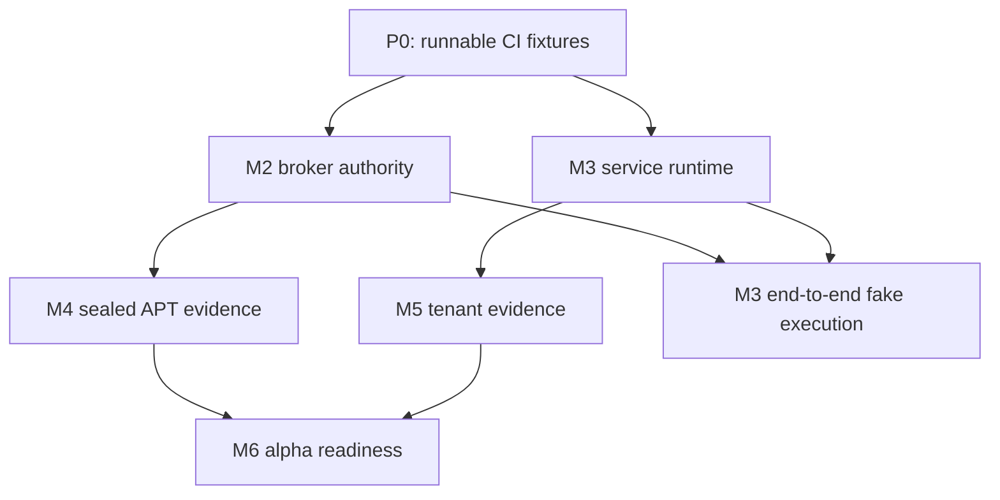

# RootPermit M2–M5 execution backlog

**Status:** implementation plan, reconciled 2026-08-12 against `main` at
`d5bed3c`.

**Authoritative product contract:** Engineering Specification v2, sections 4–10.
Engineering Specification v1 remains normative for the M4 adversarial APT matrix
and M5 tenant-isolation scope.

## Outcome and release rule

This backlog completes the MVP's four remaining security milestones:

- **M2:** a root-owned broker can complete a fully local, fake-execution request
  lifecycle and issue a verifiable receipt without exposing a root capability.
- **M3:** a root-enrolled device can pair to the official service, render a
  broker-verified request, accept a broker-bound passkey decision, and return a
  fake-execution receipt.
- **M4:** the exact APT transition claim is proven on a pinned Ubuntu AMD64
  fixture, or the product claim is narrowed in writing.
- **M5:** the hosted control plane is proven to preserve tenant boundaries under
  deliberate substitution across every data path.

M4 and M5 are independent **hard gates**.  M6 may not make either a real package
installation claim or a multi-tenant hosted-alpha claim until both exit reports
are green.

## Verified baseline

| Area | Present today | Missing for milestone exit |
|---|---|---|
| M2 broker | SQLite state/CAS, one-active-request invariant, typed package input, fake planner, event digests, lifecycle-race model | durable migrations/opening, real Unix socket server, broker key/COSE receipts, WebAuthn wired into CAS, root admin, kernel integration tests |
| M3 relay/service | mailbox simulator, tenant-scoped repository models, approval-web boundary, projection gap model, outbox lease model | HTTP relay transport, account session runtime, pairing transcript, credential lifecycle, signed service proofs, real protocol verifier, end-to-end phone-to-broker flow |
| M4 helper | FD/environment/argv fail-closed startup boundary, manifest parser, object hash checks, graph-normalisation model | `libapt-pkg` private simulation, locking/execution, systemd sandbox, journal/recovery, pinned adversarial VM matrix |
| M5 tenant isolation | schema/RLS baseline, transaction-local tenant context, repository and worker contracts, a live SQL RLS job | actual HTTP/worker/cache/notification/export/support paths and concurrent two-tenant substitution suite |

The TypeScript baseline currently passes: 27 tests plus 7 migration-contract
tests.  CMake/CTest, Rust/Cargo, PostgreSQL and `libapt-pkg-dev` are unavailable
in this workspace, so C++ and Rust verification remains delegated to Linux CI.

## Non-negotiable implementation rules

1. No route, relay message, service projection, or account session may be treated
   as authorization to execute root work. The broker verifies the signed decision
   and wins the final lifecycle CAS.
2. The agent supplies only a package name and an idempotency key. No path,
   version, APT flag, repository, URL, architecture, environment, or command text
   enters the APT helper boundary.
3. Each ticket adds the named regression tests and a stable error mapping in the
   same pull request. A green happy path is not a completion criterion.
4. New hosted tables, jobs, cache keys, storage keys, event topics, and support
   tools must carry a server-derived tenant context before implementation starts.
5. Any result after a helper crash that cannot be proved from journal and package
   state becomes `recovery_required`; it is never automatically replayed.

## Dependency and merge order

Merge only within these bands; tickets inside a band may be worked in parallel if
they do not edit the same module.

| Band | Tickets | Merge condition |
|---|---|---|
| 0 | P0-01 through P0-03 | CI has a reproducible Ubuntu runner and fails closed when a required capability is absent. |
| 1 | M2-01, M2-02, M2-03, M3-01, M3-02, M5-01 | Interfaces and schema revisions are reviewed; no end-to-end authority is enabled. |
| 2 | M2-04 through M2-07, M3-03 through M3-06, M5-02 through M5-04 | Every new authority/data path has its unit and integration tests. |
| 3 | M3-07, M3-08, M4-01 through M4-05, M5-05 | Disposable single-tenant E2E is green; real APT code remains unreachable without a sealed plan. |
| 4 | M4-06, M4-07, M5-06 | Independent evidence reports are attached and the full relevant CI lane is green. |

## P0. Make the evidence runnable

| ID | Scope and implementation contract | Tests and exit evidence | Depends on |
|---|---|---|---|
| P0-01 | Add a `ci/` toolchain image or setup action pinning Rust 1.89.0, CMake/CTest, `libapt-pkg-dev`, PostgreSQL client/server, and the current Debian/Ubuntu APT version. Make `helper/apt-helper/CMakeLists.txt` require `libapt-pkg` only for M4 targets. | GitHub Actions runs `cargo fmt`, Clippy, workspace tests, CMake/CTest, and the live PostgreSQL script. A missing tool is a failing prerequisite, not a skipped gate. | — |
| P0-02 | Replace contract-only fixture manifests with image-digest-pinned Ubuntu AMD64 fixture provisioning. Declare package repositories, architecture, kernel, APT/dpkg versions, and artifact-retention paths. | CI verifies the image digest and fixture manifest schema before a privileged test starts. | P0-01 |
| P0-03 | Add CI lane selection: fast PR, PostgreSQL integration PR, privileged nightly, and release-candidate. Preserve artifacts for failing privileged runs. | A path-filter test proves M4/M5 changes cannot bypass their applicable job. | P0-01, P0-02 |

## M2. Local broker, requester isolation, and receipt lifecycle

### M2-01 — durable store and monotonic time

Implement a versioned SQLite migration runner and a root-owned database opener.
Persist request deadline, broker boot epoch, plan digest, approval context digest,
event timestamps, credential generation, receipt bytes, and recovery evidence.
Use a monotonic clock abstraction for every pending/approved deadline. Startup
must expire non-executing work when the boot epoch changes.

Tests: migration upgrade from every released schema; power-loss simulation around
each transaction; reboot expiry; one-active-request constraint; exact-idempotency
recovery; database corruption maps to a bounded `corrupt_state`/recovery error.

Files: `crates/rp-broker-core/`, new `crates/rp-broker-core/migrations/`,
`crates/rp-testkit/`.

### M2-02 — real local Unix-socket API

Implement a root-owned Unix socket at the packaged broker path. Obtain requester
identity exclusively via `SO_PEERCRED`; do not trust a UID in a frame. Enforce
socket mode/group ownership, bounded request/frame sizes, per-UID request
ownership, opaque pagination cursors, and generic non-disclosure responses for
get/list/cancel/receipt operations.

Tests: two real Linux UIDs plus root exercise submit/get/list/cancel/receipt;
cross-UID responses have the same code, body shape, and bounded timing class as
not-found; malformed/oversize/trailing frames never reach broker state.

Files: `crates/rp-broker-api/`, `crates/rp-cli/`, `crates/rp-testkit/`,
packaging systemd/socket-unit definitions introduced only as test fixtures here.

### M2-03 — broker key, frozen plans, and exact input policy

Generate and protect one root-local Ed25519 broker key. Bind a request to its
canonical `Request`, frozen fake-plan, nonce, boot epoch, credential generation,
monotonic deadline, and request digest. Replace the current allowlist-only test
policy with a root-configured policy interface whose default remains deny.

Tests: known-answer COSE/CBOR vectors, denied package before persistence, package
name grammar boundaries, no-change/invalid/pending fake-plan transitions, key
file permission/ownership rejection, and a request cannot reuse a plan across
device, generation, or boot epoch.

Files: `crates/rp-broker-core/`, `crates/rp-protocol/`,
`protocol-vectors/`, `crates/rp-testkit/`.

### M2-04 — broker-side WebAuthn decision and lifecycle race engine

Connect the reviewed WebAuthn library adapter to the broker pending-record
lookup. The broker reconstructs the expected `ApprovalContext`, verifies the
pinned credential/generation/UV/origin/RP/challenge, records sign-counter
anomalies, and executes one durable CAS for approve, deny, expiry, cancellation,
revocation, and generation advancement. A service result is only an input object
to this verifier.

Tests: TM-06 through TM-08, including approve-to-deny substitution, replay,
wrong origin/RP/no UV, quarantined/unpinned credential, cancel-vs-approve,
expiry-vs-approve, revoke-vs-approve, generation-vs-approve, and only one event
chain winner under deterministic concurrent scheduling.

Files: `crates/rp-broker-core/`, `crates/rp-web-authn/`,
`crates/rp-protocol/`, `crates/rp-testkit/`.

### M2-05 — receipt and local audit evidence

Create one broker-signed COSE receipt for every terminal state, including denied,
expired, stale, cancelled, no-change, invalid, fake succeeded, fake failed, and
recovery-required outcomes. The receipt includes request/plan/decision/event
chain digests, key IDs, generation, terminal code, monotonic/UTC evidence, and
never includes agent notes or assertion bytes.

Tests: receipt vector round trips; tampered payload/header/key/role fail; every
terminal transition yields exactly one receipt; receipt retrieval remains scoped
to the peer UID; logs/metrics redaction snapshots contain no secret/assertion/raw
agent text.

Files: `crates/rp-broker-core/`, `crates/rp-protocol/`,
`protocol-vectors/`, `crates/rp-cli/`.

### M2-06 — root administration and recovery workflow

Implement a separate root-only administration channel for policy inspection,
start pairing, credential recovery initiation, state inspection, and
reconciliation. It cannot be invoked through the requester socket. Recovery may
transition only `recovery_required` to proved success/failure and must attach
operator evidence to an audit event.

Tests: unprivileged peer cannot reach any admin operation; recovery cannot restart
execution; normal request/list endpoints do not reveal root-only evidence;
invalid/insufficient reconciliation proof is rejected.

Files: `crates/rp-cli/src/admin.rs`, `crates/rp-broker-api/`,
`crates/rp-broker-core/`.

### M2-07 — local milestone harness

Build a process-level harness that starts the real broker socket, submits a typed
request from an unprivileged UID, exercises fake planning, applies a signed
approve/deny object, races cancellation/expiry, and validates the receipt with an
independent verifier. It must run without APT mutation.

Tests: scenario table for created, retry, policy deny, no change, invalid, deny,
approve/fake success, cancel, expiry, stale, and simulated broker restart. The
M2 report names every scenario and the CI command that ran it.

Files: `crates/rp-testkit/`, new integration tests under `crates/`,
`.github/workflows/ci.yml`, `docs/evidence/m2-local-broker.md`.

**M2 exit:** P0–M2-07 green on Linux CI. The harness executes no real package
manager operation.

## M3. Relay, hosted control plane, pairing, and approval web

### M3-01 — persistent outbound relay and opaque mailbox

Replace the in-memory relay model with an unprivileged durable spool. Persist an
envelope before HTTPS delivery and delete it only after a mutually authenticated
service acknowledgement. Use direction-specific idempotency keys and envelope
IDs as routing hints only. The relay neither parses as authority nor holds broker
or passkey private keys.

Tests: restart while queued, duplicate acknowledgement, duplicate/drop/reorder
delivery, malformed/foreign envelope, full mailbox, backoff cap, and service
acknowledgement that does not imply execution.

Files: `crates/rp-relay/`, `crates/rp-broker-core/`, `crates/rp-testkit/`.

### M3-02 — service runtime and authenticated routing

Turn the TypeScript API contracts into an HTTP runtime with official-origin
configuration, account-session authentication, server-derived tenant context,
RFC 7807 bounded errors, `Cache-Control: no-store`, CSP, CSRF/session protections,
and request/device relationship authorization. Keep account authentication and
approval authority structurally separate.

Tests: route-level tests for all section 6.3 endpoints; unauthenticated,
cross-tenant, malformed-ID, expired session, cache, and CSP/CSRF failures. The
router must not expose an endpoint that accepts an execution request.

Files: `service/api/`, `service/web/`, `service/migrations/` only when schema
gaps are demonstrated.

### M3-03 — root-started pairing transcript

Implement the canonical root-created, single-use pairing object and service claim/
confirm flow. Website/account access can claim and confirm a pointer, but only a
matching broker confirmation activates the device. Persist transcript digests and
strict expiry/consumption state.

Tests: pairing QR replay, claim from wrong tenant, browser-only claim/confirm,
expired code, comparison mismatch, duplicate completion, and restart between each
pairing transition. Only the final matching broker event creates `active`.

Files: `crates/rp-protocol/`, `crates/rp-broker-core/`, `crates/rp-relay/`,
`service/api/`, `service/migrations/`, `service/web/`.

### M3-04 — broker-pinned credential lifecycle

Implement root-authorized credential enrollment/replacement and service-routed
revocation. Enforce 1–5 ES256 credentials per device, user verification, opaque
credential IDs, broker generation change, quarantine propagation, and
`approval_locked` when the final credential is revoked. Account recovery can only
reduce authority.

Tests: add sixth credential, wrong algorithm, duplicate credential, replacement
without a root pairing, final revocation, recovery-session authority escalation,
stale generation, and signed revocation ordering.

Files: `crates/rp-web-authn/`, `crates/rp-broker-core/`,
`crates/rp-protocol/`, `service/api/`, `service/migrations/`, `service/web/`.

### M3-05 — shared verifier and verified approval interface

Provide a single TypeScript/WASM consumer for the Rust protocol-vector corpus and
use it before any approval page data renders. The page displays package target,
dependencies/removals/downgrades, origin, archive/disk impact, device, policy,
digest, and expiry. Agent text is escaped and visually secondary. Approve and
deny construct distinct contexts using exactly the pinned credential IDs.

Tests: shared positive/negative protocol corpus in Rust and TypeScript; DOM
snapshots for untrusted note separation; expiry/gap disable actions; no challenge
from route/query/local-storage/projection; accessibility and mobile viewport
smoke test on the approved wireframe.

Files: `service/web/`, `crates/rp-protocol/`, `protocol-vectors/`,
`service/web/test/`.

### M3-06 — decisions, proofs, projections, and resync

Validate bounded CBOR and assertion inputs at the service boundary, reject
quarantined credentials, retain an assertion reference only, and issue a
role-scoped service acceptance/revocation proof. The broker verifies that proof
and still verifies the assertion/CAS itself. Apply broker events only as a
derived projection; a sequence gap freezes action and creates one tenant-bound
resync intent.

Tests: service cannot manufacture an executable approval; proof wrong role/key/
validity/digest; duplicate/conflicting decision; event reorder/drop/replay;
resync replaces only a verified contiguous chain; foreign request IDs return the
same safe response as absent IDs.

Files: `service/api/`, `service/worker/`, `service/migrations/`,
`crates/rp-relay/`, `crates/rp-broker-core/`.

### M3-07 — disposable single-tenant E2E evidence

Create an E2E harness with a real broker process, relay transport double, service
runtime, and browser WebAuthn virtual authenticator. Root-enroll a device, pair
it, show a verified request, make a bound approve and deny decision, and return a
broker-signed fake-execution receipt.

Tests: primary approve, deny, revoked credential, final-credential lock,
projection gap/resync, relay restart, service restart, and broker restart. Store
only synthetic data and attach traces/screenshots/receipts as CI artifacts.

Files: new `tests/e2e/`, `.github/workflows/ci.yml`, `docs/evidence/m3-e2e.md`.

### M3-08 — M3 claim review

Write a short evidence report that states exactly what the fake-execution flow
proves and explicitly excludes real package installation and hosted-alpha
tenant claims. This prevents the E2E demo from silently expanding the product
claim.

**M3 exit:** M3-01 through M3-08 pass on disposable single-tenant data. M5 is
still required before multi-tenant alpha data.

## M4. Sealed APT plan evidence gate

### M4-01 — sealed content-addressed plan store

Have the broker create a root-owned sealed directory containing lists, archives,
preferences, source configuration, manifest, normalised action graph, and plan
metadata. Open it with directory FDs and `openat2`-style no-symlink/no-magic-link
rules where available; verify owner, permissions, link counts, and SHA-256 before
handoff. The helper receives a broker-created sealed-plan handle, not a path.

Tests: symlink/hardlink/path traversal/permission/hash/manifest swap, unexpected
FD, and post-seal modification. Every failure occurs before simulation/mutation.

Files: `crates/rp-broker-core/`, `helper/apt-helper/`, `crates/rp-testkit/`.

### M4-02 — authenticated helper protocol and service sandbox

Define a small versioned control protocol over a private broker-helper socket or
inherited authenticated FD. Reject argv other than a fixed executable invocation,
unexpected environment, extra descriptors, non-root broker peer, malformed plan
handle, and protocol version mismatch. Ship a systemd unit with filesystem,
capability, namespace, syscall, and network restrictions compatible with required
APT/dpkg behavior.

Tests: hostile helper startup matrix plus systemd-analyze/security regression and
an integration test proving the sandbox cannot access a non-sealed path or
network. Document any unavoidable privilege/residual risk.

Files: `helper/apt-helper/`, `packaging/systemd/`, `docs/security/`.

### M4-03 — private libapt-pkg simulation and graph equality

Use `libapt-pkg`, not shell parsing or `apt-get`, to configure an entirely sealed
private APT view. Take APT/dpkg locks before reading installed state, select every
recorded candidate, simulate, normalise the action graph canonically, and compare
its bytes to the approved graph. Unsupported APT behaviour fails closed.

Tests: candidate/version/dependency/removal/downgrade/origin/disk graph vectors;
list/archive/preferences/source drift; native-architecture enforcement; empty
and invalid plans; exact-byte mismatch maps to `prestate_drift`.

Files: `helper/apt-helper/`, `protocol-vectors/`, `fixtures/ubuntu-amd64/`.

### M4-04 — lock-held execution with no live input

Execute the previously proven plan while retaining APT/dpkg locks. Prove the
helper does not read live lists/archives, fetch network data, accept hooks from
unsealed configuration, or re-resolve candidate versions. The broker may enter
`executing` only after one final approval/expiry/generation CAS succeeds.

Tests: live-cache/network/package-manager drift; competing APT process; lost
lock; archive removal; disabled-network run; selected real fixture package; safe
winner/loser behaviour around execution authorization.

Files: `helper/apt-helper/`, `crates/rp-broker-core/`,
`fixtures/ubuntu-amd64/`.

### M4-05 — journal and manual reconciliation

Add durable markers before/after helper handoff, simulation proof, execution
start, dpkg result observation, receipt creation, and final state commit. Fault
injection after each marker must leave a state that can be proved as success or
failure, otherwise `recovery_required`. The root reconciliation command records
evidence but never retries an ambiguous execution.

Tests: process kill/power-loss injection at every marker; corrupt/truncated
journal; helper crash; dpkg interruption; broker restart. Assert no false
success, no automatic retry, and no active request is released prematurely.

Files: `crates/rp-broker-core/`, `helper/apt-helper/`,
`crates/rp-cli/src/admin.rs`, `fixtures/ubuntu-amd64/`.

### M4-06 — pinned Ubuntu AMD64 adversarial matrix

Implement every Engineering Spec v1 section 6.4 category as an isolated fixture
scenario: metadata/archive swap, symlink/hardlink/FD/env/argv attack, live cache/
network/package-manager drift, hooks/triggers, locks, and every journal marker.
Capture manifest, logs with secrets redacted, action graphs, package state, and
receipt/recovery outcome for each test.

Tests: TM-11 through TM-13 are CI-gated in privileged nightly and complete on a
pinned clean image before release candidate approval.

Files: `fixtures/ubuntu-amd64/`, `tests/privileged/`,
`.github/workflows/privileged-nightly.yml`, `docs/evidence/m4-ubuntu-amd64.md`.

### M4-07 — exact-claim review

Write and approve the M4 evidence report. It must state the exact supported
Ubuntu/APT/dpkg scope, verified action-graph claim, fixture hashes, retained
artifacts, hook/trigger residual risk, and any claim narrowing required by a
failed or unsupported case.

**M4 exit:** M4-01 through M4-07 run reproducibly on the pinned Ubuntu AMD64
fixture. No feature flag or manual demo substitutes for this result.

## M5. Hosted multi-tenant isolation evidence gate

### M5-01 — production repository transaction boundary

Make every API and worker repository execute through a single transaction helper
that derives tenant/account from authenticated server state, calls
`set_config('app.tenant_id', ..., true)`, and rejects unscoped queries. Ban raw
database access outside that boundary with lint/architecture tests. Use a
non-owner, non-BYPASSRLS application role in integration tests.

Tests: every repository route has a missing-context, tenant-A, tenant-B, and
substituted-public-ID case; pooled connection context reset; application guard
still rejects a foreign relation if RLS is deliberately disabled in a test.

Files: `service/api/`, `service/worker/`, `service/migrations/`,
`service/migrations/test/`.

### M5-02 — live RLS mutation and schema-completeness suite

Extend the existing SQL check from `accounts` to every tenant-bearing table and
every relationship write. Verify FORCE RLS, policy presence, foreign-key tenant
relations, definer-function search path/privilege limits, and the absence of
owner/BYPASSRLS use by application credentials.

Tests: tenant A cannot select, insert, update, delete, or infer a tenant-B row by
ID, public ID, parent ID, cursor, or relation. The same script proves local GUC
reset after commit and rollback.

Files: `service/migrations/test/live-tenant-isolation.sql`, new SQL fixtures,
`.github/workflows/ci.yml`.

### M5-03 — worker, retry, dead-letter, and relay propagation

Implement durable job envelopes with tenant ID, relation tuple, event digest,
lease generation, retry schedule, and safe failure code. Each delivery/retry/
dead-letter operation re-authorizes its relation in a new tenant transaction;
workers cannot inherit a prior row's context.

Tests: mixed A/B concurrent leases, retry/dead-letter substitution, lease steal,
duplicate event, stale job, corrupted tenant/relation tuple, and a worker crash
between claim and completion.

Files: `service/worker/`, `service/migrations/`, `service/api/`,
`tests/integration/`.

### M5-04 — cache, polling, notifications, websocket, and object boundaries

Implement the actual cache/topic/destination/storage adapters only with
server-computed `tenant + account + resource` keys. Cache payloads include their
tenant and are rejected on mismatch. Subscription topics, notification targets,
object URLs, and pagination cursors are authorized against database relationships
at issue time.

Tests: substitute each key/topic/cursor/path/destination/cache payload between A
and B; cache hit/miss parity; reconnect/replay; notification retry; expired signed
URL; no global public-ID search.

Files: `service/api/`, `service/worker/`, new adapter modules and integration
tests. No Redis/Kafka/Kubernetes is introduced for alpha.

### M5-05 — export, deletion, backup/restore, audit, and support controls

Implement hosted-history export/deletion requests without modifying broker
authority or local receipts. Backups/restores run into an isolated target, retain
tenant separation, and do not trigger relay delivery. Support access is explicit,
tenant-bounded, time-limited, reasoned, and audited.

Tests: A cannot export/delete/read B; restored data remains tenant-scoped; restored
authority stays inert; support grants expire and cannot search a foreign global
public ID; logs/traces/export snapshots exclude assertions/tokens/raw agent text.

Files: `service/api/`, `service/worker/`, `service/migrations/`,
`docs/runbooks/`, `tests/integration/`.

### M5-06 — concurrent two-tenant adversarial suite and report

Run tenants A and B concurrently through the real API, worker, polling,
notification, export, backup/restore, and support flows. Systematically substitute
every tenant/public/parent/cursor/job/cache/topic/object identifier while retries,
leases, and projection resync are active. Record test seed, request traces, and
the foreign-boundary result without retaining sensitive payloads.

Tests: TM-14 through TM-16 pass with both RLS and application authorization
enabled; mutation subtests disable one layer at a time to prove the other catches
the applicable escape. The CI report names every covered data path.

Files: `tests/tenant-isolation/`, `.github/workflows/ci.yml`,
`docs/evidence/m5-tenant-isolation.md`.

**M5 exit:** M5-01 through M5-06 are green against PostgreSQL 16 under a
non-owner application role, with the complete two-tenant report retained by CI.

## Parallel implementation lanes

| Lane | Owns | Start | Handoff |
|---|---|---|---|
| A: broker authority | P0-01, M2-01..07 | immediately | sealed-plan broker interface for M4 and signed request/receipt interfaces for M3 |
| B: hosted core | M3-02..06, M5-01..03 | immediately after P0-01 | authenticated tenant transaction and relay/proof API for E2E |
| C: relay and web | M3-01, M3-03..05, M3-07..08 | M2 protocol interfaces stable | M3 fake-execution evidence |
| D: sealed helper | P0-02..03, M4-01..05 | after M2 sealed-plan interface is reviewed | fixture matrix inputs and recovery contract |
| E: isolation evidence | M5-02, M5-04..06 | after service runtime boundaries exist | M5 evidence report |

Lanes A and B agree the Rust/TypeScript protocol vector version before merging.
Lanes D and E must not change authority semantics; they consume the broker/service
interfaces behind explicit compatibility tests.

## Pull-request and test contract

Every ticket has one primary owner and a separate security reviewer for changes
to `rp-protocol`, broker state transitions, helper IPC/sandboxing, RLS/definer
SQL, or WebAuthn. Each PR must include:

1. a ticket ID in the title and a link to its threat-matrix rows;
2. a minimal API/schema delta and compatibility/vector update where applicable;
3. unit tests plus the named process, PostgreSQL, browser, or VM test layer;
4. stable error-code and redaction assertions;
5. rollback steps. Database changes are expand/contract; helper/broker changes
   default fail-closed and are disabled on incompatible persisted state.

CI merge requirements:

| Change area | Required checks |
|---|---|
| Protocol, broker, relay, WebAuthn | Rust fmt/Clippy/tests, vector corpus, Linux socket integration when IPC changes |
| Service or migrations | Node checks, PostgreSQL live RLS suite, two-tenant tests when a new data path is added |
| Approval web | Node tests, shared-verifier vectors, browser E2E when ceremony/rendering changes |
| Helper or fixture | CMake/CTest, sandbox contract, selected privileged Ubuntu fixture; nightly full matrix for M4 changes |
| Release claims/evidence docs | Corresponding M2/M3/M4/M5 artifact-report job and security review |

## Explicitly deferred from this backlog

- M6 Ubuntu packaging/deployment/alpha operations.
- M7 Raspberry Pi ARM64 fixture and release work.
- M8 release signing, SBOM/provenance completion, external assessment, and public
  developer release.
- Any generalized privilege broker, remote shell, arbitrary command approval,
  self-hosting promise, or support for non-native/URL/local Debian packages.

## Definition of ready to begin implementation

Start with P0-01 and the Band 1 interfaces. Before approving implementation work,
confirm that each ticket has an owner, interface consumer, exact CI command, and
retained evidence artifact. Do not begin M4 execution or M5 multi-tenant alpha
work on a branch whose applicable P0/M2/M3 interfaces are still changing.
