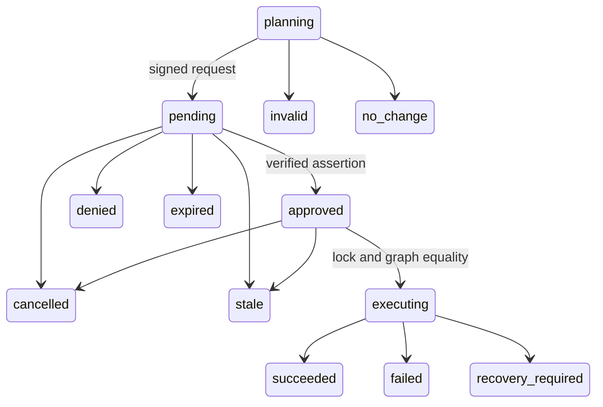
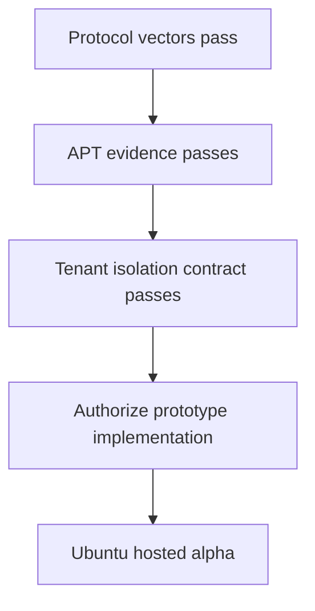

# RootPermit v1 Engineering Specification

**Status:** Engineering decisions closed, implementation blocked on evidence gates
**Date:** 2026-08-12
**Product baseline:** `project_sources/01-rootpermit-office-hours-design.md` and `project_sources/03-rootpermit-prd-3-.md`
**Scope:** the one `package.install` vertical slice only

## 1. Decision record

This specification resolves the remaining engineering choices consistently with the accepted product boundary: RootPermit authorizes one exact package-manager state transition. It never transfers a privileged identity to an agent, turns the hosted service into an execution authority, or accepts arbitrary shell input.

| ID | Decision | Normative v1 rule |
|---|---|---|
| D1 | Wire format | Deterministic CBOR, as profiled below, inside COSE_Sign1 envelopes. |
| D2 | Broker identity | One locally generated Ed25519 signing key per broker. COSE `alg=-8` and protected opaque `kid`. |
| D3 | Passkey binding | A fresh broker nonce and canonical `ApprovalContext` bind both `approve` and `deny` assertions. |
| D4 | Expiry | Broker-monotonic deadline tied to the current boot is authoritative. No request survives a reboot. |
| D5 | Remote revocation | Prospective: the service quarantines immediately; broker acknowledgement advances credential generation and stales non-executing work. |
| D6 | Service proof keys | A service-root public key is pinned in the broker package; root-signed, rotating online keys sign service proofs. |
| D7 | APT execution | A dedicated C++ `libapt-pkg` helper accepts only a broker-created sealed plan handle. No shell or agent-controlled APT arguments. |
| D8 | APT inputs | Root-owned content-addressed metadata and artifact snapshot plus immutable manifest. The helper never reads live lists or archives. |
| D9 | Host drift | Take locks, re-simulate from the sealed snapshot, require exact normalized action-graph equality, then execute while retaining locks. |
| D10 | Enrollment pairing | Root-started, single-use, transcript-confirmed pairing using a service-signed enrollment statement. Browser/account access alone cannot activate a device. |
| D11 | Pre-state scope | No package-manager pre-state is pre-declared safe to ignore. Only a proved-identical re-solved action graph permits execution. |
| D12 | WebAuthn | User verification required; ES256 is the sole v1 credential algorithm; no attestation trust; credentials are explicitly selected from the broker-pinned set. Counter anomalies are recorded and surfaced, not treated as universal clone proof. |
| D13 | Hosted account recovery | A separate account-access recovery path may restore account access but cannot add, replace, reactivate, or unenroll broker approval authority. It may only perform authority-reducing revocation. |
| D14 | Tenant isolation | The service has immutable, server-derived tenant context for every user-owned object and async path, with application checks plus database RLS as defense in depth. |

## 2. Non-negotiable boundaries

1. Only `rootpermitd` may create a request digest, accept an approval, authorize execution, advance authoritative lifecycle state, or sign a receipt.
2. The relay transports opaque signed objects. It has no broker private key, no passkey key, no root credential, and no ability to construct an approval-capable request.
3. The official service is trusted for rendering and coordination, but is not a root principal. It cannot directly call the broker or cause execution without a valid, current passkey assertion that the broker independently verifies.
4. The package helper is not a generic command launcher. It takes no package names, paths, APT/dpkg flags, environment values, shell fragments, URLs, or network inputs.
5. v1 supports one native-architecture Debian binary package name requested by the peer UID. The broker, not the caller, chooses every version, dependency, artifact, and package-manager input.

## 3. Protocol profile

### 3.1 Encoding and general validity

All protocol payloads are deterministic CBOR under RFC 8949. The encoder and verifier MUST:

- use definite-length maps, arrays, byte strings, and text strings;
- use shortest permitted integer encodings;
- use map-key ordering mandated by deterministic encoding;
- reject floating point, tags unless a specific message field declares one, duplicate keys, indefinite lengths, and trailing bytes;
- use unsigned integers for schema keys and protocol enums;
- reject absent required fields, malformed byte lengths, and every unknown field in a v1 security-critical message; and
- limit every decoded message, nesting level, map size, string, byte string, and array before allocation.

Human-facing fields are projections. The authoritative record is the verified CBOR payload. Digests are 32-byte SHA-256 values; IDs and key IDs are opaque byte strings and must not be converted into strings before hashing.

Every signed object carries `version = 1`. A v1 peer MUST reject any other version with `protocol_mismatch`; it must not attempt a best-effort parse or silently negotiate down. Future optional data needs a separately versioned message type, not ignored v1 fields.

### 3.2 COSE envelopes

Broker-originated requests, lifecycle events, receipts, enrollment acknowledgements, and local export manifests use `COSE_Sign1`. Required protected header parameters are:

```text
1  alg = -8                 EdDSA / Ed25519
4  kid = broker key ID      opaque, 8–32 bytes
3  content type             integer registered by this specification
```

The unprotected header MUST be empty in v1. Any protected-header duplication, unsupported algorithm, unknown critical header, detached payload, or signer key not valid for the relevant device and broker epoch is invalid.

The broker signing key is generated locally with a cryptographically secure OS RNG, stored root-readable only, and never crosses the device. Key rotation or loss is a root-controlled identity reset: all non-executing requests become terminal `stale`; historic public keys remain for receipt verification; fresh enrollment is required.

### 3.3 Domain separation

Every hash and signature context begins with an exact ASCII label and NUL byte. A value must never be valid in two protocol roles.

| Use | Prefix |
|---|---|
| broker request digest | `rootpermit/v1/request\0` |
| frozen APT plan digest | `rootpermit/v1/apt-plan\0` |
| decision context | `rootpermit/v1/decision\0` |
| WebAuthn challenge | `rootpermit/v1/webauthn.challenge\0` |
| enrollment statement | `rootpermit/v1/enrollment\0` |
| service keyset | `rootpermit/v1/service-keyset\0` |
| service decision acceptance proof | `rootpermit/v1/decision-accepted\0` |
| revocation event | `rootpermit/v1/revocation\0` |
| receipt | `rootpermit/v1/receipt\0` |

For every listed use, the bytes to hash are `ASCII-prefix || deterministic-CBOR(value)`. Where a COSE signature is required, the prefix is represented as COSE external authenticated data. Implementations MUST use the published vectors, never compose strings ad hoc.

### 3.4 Request and decision objects

`Request` has these required semantic fields:

```text
request_id                bytes(16), broker-generated
device_id                 bytes(16), stable enrolled device ID
broker_epoch              uint
protocol_version          uint = 1
credential_generation     uint
created_at_utc            integer, display only
expires_at_utc            integer, display only
boot_id                   bytes(16)
deadline_monotonic_ns     uint, broker-only authority
approval_nonce            bytes(32)
requester_uid             uint
operation                 enum package.install
operation_input           { package_name: restricted ASCII text }
policy_id, policy_digest  bytes
apt_plan_digest           bytes(32)
frozen_plan               exact normalized plan projection
```

The `request_digest` is computed over the complete request payload excluding itself, then included only in later objects. The planned package list records package name, native architecture, installed version, target version, action, origin identity, `.deb` SHA-256, installed size, archive size, dependency relationship, and a non-empty source identity. A v1 plan containing removals, downgrades, held packages, foreign architecture, a non-repository source, unknown artifact hashes, or an action outside `install` is terminal `invalid`, not approvable.

For a user decision, the website constructs exactly this `ApprovalContext`:

```text
protocol_version
request_id
device_id
broker_epoch
request_digest
credential_generation
approval_nonce
rp_id
origin
decision                  enum approve | deny
expires_at_utc            informational display bound
```

`challenge = SHA-256("rootpermit/v1/webauthn.challenge\\0" || deterministic-CBOR(ApprovalContext))`.

The website may create the WebAuthn request only after verifying the broker COSE envelope and reconstructing `request_digest`. It sends the assertion plus the complete context to the service. The service transports it unchanged and may issue a decision-acceptance proof; the broker independently reconstructs the context from its pending record and accepts the assertion only once.

The broker verifies: live `pending` state, its current boot ID and monotonic deadline, `request_id`, `device_id`, broker epoch, request digest, generation, nonce, decision bit, RP-ID hash, exact origin, `type=webauthn.get`, client-data challenge, credential ID, credential public key, assertion signature, user-presence and user-verification flags, and single-use state. Any mismatch returns a named failure and leaves the lifecycle non-executing. `deny` is signed and produces a terminal `denied` receipt.

### 3.5 Expiry, races, and lifecycle

The broker creates a request with a fresh boot ID and a monotonic deadline of at most 10 minutes by default and 30 minutes hard maximum. UTC fields are for UX only. A broker restart, boot-ID change, missing durable monotonic basis, or uncertain suspend/resume expires every non-executing request conservatively. A decision received after expiry never changes state, even if the website countdown remains positive.

Transitions are one database transaction under a per-device lifecycle lock:



`approved → executing`, local cancellation, revocation/generation advance, and expiry contend on the same durable record. Exactly one transition wins. Once `executing` commits, revocation and cancellation never interrupt the helper. A crash between the commit and a final package-manager result enters `recovery_required` until root reconciliation produces an honest `succeeded` or `failed` result; RootPermit never claims rollback.

Every transition emits a broker-signed, append-only event with per-request sequence, previous-event hash, broker epoch, request digest, transition, and timestamp. The hosted projection applies only consecutive verified events. A gap freezes projection and requests resynchronization; it cannot infer a missing state.

### 3.6 Service root and online signing keys

The broker package pins a long-lived offline `service-root` Ed25519 public key. The root signs a `ServiceKeyset` listing online key `kid`, COSE algorithm, public key, `not_before`, `not_after`, and permitted roles (`decision_proof`, `revocation`, `enrollment`). A broker accepts an online signature only when:

- the key exists in a root-verified, unexpired keyset;
- its role permits that message type;
- its validity window contains broker wall-clock time only as a conservative check; and
- the object is bound to this device, request, generation, and protocol version.

Keysets are additive only while valid. A keyset cannot silently remove the service root or cause protocol downgrade. Emergency root-key replacement requires a signed broker software update, never a service message. Service proofs are useful evidence and revocation ordering data; they never override broker lifecycle authority.

## 4. Enrollment and credential lifecycle

### 4.1 Root-started pairing

Pairing begins only from an authenticated root console or trusted SSH session. The broker persists a provisional record before showing its pairing URL/QR. It contains a fresh 32-byte nonce, local comparison code, device ID, broker public key, requested credential-generation, expiry, expected official origin/RP ID, and the broker's root-session confirmation state.

The QR URL is a bearer pointer to this short-lived provisional record, not enrollment authority. The browser account, website, or QR possession cannot activate a device. The user compares the code in the trusted web session with the independently rendered root session and both sides record confirmation. Pairing expires after 10 minutes, is single use, and its nonce is permanently consumed on success, expiry, failure, or broker restart without intact durable provisional state.

The service creates a provisional device and returns a root-signed `EnrollmentStatement` binding account ID, device ID, broker public key, full proposed credential set, pairing nonce, expected origin/RP ID, protocol version, next credential generation, and statement expiry. The browser obtains a user-verified registration/assertion from one credential in that proposed set over the enrollment-statement digest. The broker verifies the root signature, its persisted pairing transcript, both confirmations, statement scope and expiry, credential proof, and exact proposed set before atomically pinning it.

Only the broker's signed activation acknowledgement promotes the service's device record from provisional to active. A failed enrollment cannot leave a partially active credential.

### 4.2 Credential rules

- An active broker pins one to five unique credential IDs and public keys. Any one may decide a request.
- Account login credentials are not automatically approval credentials. The service can never add approval authority.
- Root-controlled add, replace, remove, recovery, and acknowledged remote revocation all atomically increment `credential_generation`.
- A generation advance turns every `planning`, `pending`, and `approved` request from the prior generation into exactly one terminal `stale` event and receipt. An already `executing` request continues.
- Revoking the final credential is allowed and changes the device to `approval_locked`; it retains device identity, receipts, public verification keys, and hosted binding. New logical package submissions fail `credential_recovery_required` without a new request or notification.
- Only a root-controlled console or trusted SSH recovery can pin a non-empty replacement set and return the broker to `active`. Browser-only action, an account session, a QR, or a proposed credential alone cannot unlock it.

### 4.3 Remote revocation

An authenticated account can request an authority-reducing credential revocation. The service immediately quarantines that credential, stops accepting its new decisions, and writes a service-signed cutoff event. Its UI shows `revocation_requested`, not a false broker-state claim.

The broker verifies the event and atomically marks the credential revoked, increments its generation, stales non-executing old-generation requests, and sends a signed acknowledgement. Before that acknowledgement, an accepted pre-cutoff decision may execute only if the broker still sees the request's generation as current and it wins the atomic `approved → executing` transition. A post-cutoff page submission is rejected. This is deliberate prospective containment, not guaranteed remote cancellation.

## 5. WebAuthn profile and account recovery

### 5.1 Credential registration and assertions

The relying party is the dedicated official approval origin. v1 accepts only COSE `ES256` (`-7`) credentials. This is intentionally separate from the broker's Ed25519 signing choice: ES256 has the broadest passkey interoperability for the first external-user flow. A later profile version may add EdDSA only with vectors and a migration plan.

At registration the website requests:

```text
pubKeyCredParams:           [{ type: "public-key", alg: -7 }]
attestation:                "none"
authenticatorAttachment:   unspecified
residentKey:                "discouraged"
userVerification:           "required"
timeout:                    bounded by the request/enrollment deadline
```

V1 does not require discoverable credentials because approval sends `allowCredentials` containing the exact broker-pinned credentials for the selected device. This avoids account chooser ambiguity while supporting platform and roaming authenticators. The broker records `backupEligible`, current backup state, transports, and authenticator AAGUID only as disclosed metadata; it permits both device-bound and synced credentials and shows that class during enrollment.

Attestation is not collected or trusted in v1. RootPermit needs proof of possession of the proposed credential, not manufacturer identity. This avoids creating a brittle device-trust program that would worsen normal phone passkey onboarding without reducing the acknowledged trusted-web risk.

The service and broker verify all WebAuthn assertion requirements using a reviewed library. Neither parses CBOR/COSE credential keys with home-grown cryptography. Counters are handled as follows:

- a credential with both prior and new non-zero `signCount`, where the new value is not strictly greater, emits `counter_anomaly` with bounded metadata;
- zero counters and backup-eligible/synced credentials are not presumed clone evidence;
- the signature-valid assertion remains eligible for the single bound decision, because rejecting it would create provider-dependent denial of service;
- repeated anomalies on a credential trigger an account security notice and a root-visible local audit warning recommending replacement; they never add or remove authority automatically.

The verification result contains the actual credential ID. An assertion from a valid account passkey that is not pinned to the broker's live generation is rejected.

### 5.2 Hosted account recovery

Approval credentials and website-account credentials are distinct authority systems. Standard account access uses a separately registered website passkey as the preferred factor. The service may offer a verified-email recovery route with strong rate limits, notification to existing sessions, a 24-hour recovery hold before access is restored, and forced reauthentication for security-sensitive actions. It must disclose that email recovery can affect availability but cannot grant root authority.

An ordinary or recovered account session can only view its own hosted data, export/delete terminal hosted history, manage notifications, and request credential revocation. It cannot enroll a device, add/replace/reactivate approval credentials, advance a broker generation, approve a request without a broker-pinned approval credential, or unenroll a device. These prohibitions are enforced server-side and in the signed protocol, not merely hidden in UI.

## 6. APT sealed-plan execution

### 6.1 Artifact and metadata snapshot

At planning time, the broker resolves APT using a root-owned, authenticated repository configuration. It captures every file that can affect resolution into content-addressed storage under `/var/lib/rootpermit/store/sha256/<digest>`, including:

- repository metadata and signature verification inputs;
- source, preference/pinning, and trusted-key configuration used for resolution;
- every selected `.deb` archive;
- the relevant package-manager inputs and policy digest; and
- a deterministic-CBOR `PlanManifest` listing paths by role, SHA-256, file mode, exact action graph, source identities, and plan digest.

The manifest is root-owned, write-once, and referenced by an opaque 128-bit plan handle. Its directories are created with `openat2`-style no-symlink, beneath-root resolution where available; otherwise the spike must demonstrate equivalent fd-relative checks. The helper receives a broker-opened, read-only plan directory FD plus the handle. It does not resolve a caller path and has no option to use the normal host lists, archives, source configuration, cache, or network.

All APT acquisition is disabled at execution (`no-download` equivalent plus private archive paths). Every manifest file and archive must be present and hash-identical before APT is invoked. A missing or changed input is `artifact_drift`, never a fallback download or fresh resolve.

### 6.2 Helper contract

The helper is a fixed, root-owned executable launched only by `rootpermitd` over a private inherited channel. It has a closed command vocabulary: `verify_and_execute(plan_handle)`. It accepts no CLI arguments after the fixed program name and clears its environment to an allowlist established by the broker.

Using `libapt-pkg`, the helper:

1. validates the manifest, sealed directory FDs, and every file hash;
2. obtains the APT and dpkg locks before reading installed state;
3. builds a private APT view whose source, list, archive, preference, and state locations are all sealed-manifest controlled except current installed dpkg state;
4. explicitly selects the recorded candidate version for every package and re-simulates;
5. normalizes the new action graph and compares it byte-for-byte to the approved graph;
6. rejects removals, downgrades, unrecorded changes, missing archives, changed holds, changed origin/artifact hash, or any graph difference as `prestate_drift`; and
7. retains locks through the package-manager execution and records durable start/result journal entries.

The plan does not pre-declare a hash of `dpkg` state as the authority. That would reject harmless unrelated changes. Instead, the exact graph equality proof is the conservative rule: any changed state is acceptable only if the helper proves it cannot change the authorized transition. Until fixtures prove a field safely irrelevant, there is no ignored pre-state category.

The helper's dynamic linkage, config parser, APT method execution, hook behavior, trigger execution, privilege boundary, path handling, and crash states are part of the security perimeter and must be covered by the evidence gate below. Maintainer scripts and triggers of approved packages remain an explicit residual risk.

### 6.3 Crash reconciliation

Before package-manager invocation, the broker durably records `execution_started` with plan digest, package set, dpkg status fingerprint, and helper PID/start identity. The helper emits append-only durable progress markers around archive acceptance, unpack, configure, trigger processing, and final status collection. A broker or host crash never replays automatically.

On restart, the broker locks APT/dpkg, inspects the journal and current installed state, and produces only:

- `succeeded` if the exact intended installed state is proved and no unrecorded action occurred;
- `failed` if the journal/current state proves the transaction failed; or
- `recovery_required` if it cannot prove either result.

Root performs any human reconciliation. The resulting receipt states exactly which result is proven and retains the original plan evidence.

### 6.4 APT evidence gate

The C++ helper is not an accepted authorization component until the following executable fixture matrix passes on the pinned Ubuntu AMD64 and Raspberry Pi OS ARM64 images.

| Test family | Required evidence |
|---|---|
| Baseline install | `ffmpeg` exact graph, artifacts, versions, origins, download/disk values, receipt, and no agent root identity. |
| Snapshot integrity | Changed metadata, `.deb`, hash, permissions, hard link, symlink, list/archive/config path, or absent archive fails before mutation. |
| Solver equality | Added/removed dependency, candidate version change, install-state drift, hold change, virtual/foreign/source package, removal, downgrade, and pin change either produce exact equality or fail `prestate_drift`. |
| Isolation | Live host lists/cache/source config cannot affect simulation/execution; network is disabled; helper rejects hostile env and argv. |
| Locking | Concurrent APT/dpkg/unattended-upgrade behaviour has one safe winner, no lock bypass, and no action occurs after graph changes. |
| Hooks/triggers | Default and deliberately added hooks/triggers are enumerated; unsupported behavior blocks the claim or is fixed before release. |
| Failure/recovery | Inject failure after each journal point, kill broker/helper, reboot host, and prove honest `failed`/`recovery_required` reconciliation. |
| Portability | Same source contract and vectors pass on ARM64. Platform packaging may differ; protocol and security result may not. |

If any row cannot be proven through stable APT interfaces, RootPermit must weaken its product claim before authorization code or a public alpha. It may not replace the proof with parsed CLI output or a shell wrapper.

## 7. Hosted tenant-isolation contract

### 7.1 Identity model

`tenant_id` is an immutable server-generated UUID associated with exactly one account. Every user-owned object below carries a non-null `tenant_id`, set only by a trusted request/job context and never from request body, query parameters, event payload, or client claims:

```text
account, web_session, account_recovery, device, broker_key, service_keyset_ack,
credential_binding, pairing, enrollment_statement, request_envelope, decision,
decision_acceptance_proof, revocation, lifecycle_event, receipt_projection,
notification, websocket_subscription, rate_limit_key, object_store_record,
audit_event, export, deletion_request, job, backup_index, restore_job, support_access.
```

Each object additionally records its immediate parent relationship, such as `device_id` for a request and `request_id` for a decision. Authorization requires both (a) the authenticated subject belongs to the tenant and (b) the requested object is reachable through the expected relationship. A valid request ID alone never authorizes read, mutation, notification, websocket delivery, support lookup, or cache access.

External IDs are random, non-sequential 128-bit minimum values. Internal integer IDs are never exposed. Errors for missing, foreign, and unauthorized objects are deliberately indistinguishable where disclosure could enable enumeration.

### 7.2 Enforcement points

| Boundary | Mandatory rule |
|---|---|
| HTTP/RPC | Auth middleware derives subject and tenant. Every query is tenant-scoped before lookup; mutation rechecks relationship under transaction. |
| Database | Tables have `tenant_id NOT NULL`; foreign keys retain parent ownership; row-level security requires the transaction's verified tenant context. Service roles bypass RLS only through narrow, audited repository functions. |
| Cache | Every key begins with `tenant_id`; cache payload includes and verifies the same tenant. No global lookup by public ID. |
| Queue/workers | Job envelope includes a signed/verified internal tenant context and parent object ID. Worker establishes tenant transaction context before any read/write. Dead-letter, retry, and scheduled jobs preserve it. |
| Websocket | Handshake authenticates account, derives tenant, authorizes each subscription's parent object, and uses a server-computed tenant/topic. Fan-out never accepts a client topic string as authority. |
| Notifications | Worker re-authorizes tenant and object relationship before generating content. Destination, template data, suppression state, and idempotency key are tenant-scoped. |
| Object storage | Object key prefix is tenant ID plus object type; signed URLs are short-lived, operation-scoped, and authorized against the database relation before issue. |
| Logs/analytics | Structured logs use safe public IDs and tenant-scoped access controls. Raw envelopes, passkey assertions, email tokens, and unbounded agent text are redacted. Cross-tenant aggregate metrics have no user drill-down. |
| Support/admin | Just-in-time, time-bounded support grants name a tenant and reason; every read/export is audited. Support search cannot use a global public object ID to reveal tenancy. |
| Exports/backups/restores | Export manifests and backup indexes contain tenant ID. Restore retains original tenant binding, is tested in isolation, and cannot create executable authority or cross-tenant object links. |

Service-side signing keys are fleet-level assets and deliberately do not carry tenant IDs. Their use is constrained by a signing API that requires a validated device/request/tenant record and emits an immutable audit event. The signing service cannot construct a decision, change a broker lifecycle state, or target an arbitrary device without a verified stored relationship.

### 7.3 Isolation invariants and test gate

The hosted alpha cannot accept multi-tenant data until automated tests prove, for two randomly generated tenants A and B:

1. B cannot enumerate, read, modify, approve, deny, revoke, delete, export, subscribe to, notify about, or learn timing/count information about any A object.
2. Every API, RPC, background worker, retry, dead-letter flow, webhook/notification, websocket, cache hit/miss, object-storage URL, search index, support tool, backup job, and restore job preserves A's tenant context.
3. A compromised client can substitute IDs, tenant fields, parent IDs, cursor, queue payload, cache key, websocket topic, signed URL path, and notification target without crossing the boundary.
4. RLS and application authorization are independently tested. Disabling either in a test must make the other catch the foreign-object attempt where applicable.
5. Logs, traces, error reporting, exports, backups, and support audit trails do not expose foreign tenant content.

These are property and integration tests, not only controller unit tests. Seed factories must generate deliberately overlapping-looking public metadata and repeat the suite under concurrent requests, retries, and restore simulation.

## 8. Test vectors, conformance, and delivery gates

The protocol repository must publish machine-readable deterministic vectors before any authorization code merges:

- CBOR canonical encoding, rejection cases, and known request/plan/decision digests;
- COSE broker envelope verification, protected-header rejection, wrong key/algorithm/keyset and signature failures;
- WebAuthn challenge construction, origin/RP-ID/user-verification checks, approve/deny distinction, expired/replayed/nonced-mismatch assertions, and non-pinned credential rejection;
- enrollment success and every transcript mismatch, reuse, expiry, browser-only, and root-confirmation failure;
- keyset rotation and service proof/revocation ordering;
- complete lifecycle races: cancel/execution, expiry/execution, revocation/execution, generation/execution, reboot, duplicate event, and sequence gap;
- tenant isolation properties from section 7; and
- the APT fixture matrix in section 6.

The v1 build gate is therefore:



Failure of any first three gate blocks authorization implementation or multi-tenant alpha data, respectively. A disposable single-tenant mailbox may support protocol usability work, but it is not evidence of the hosted alpha boundary.

## 9. Explicitly deferred

- Guaranteed remote request cancellation and its required fresh pre-execution status proof. Message types are reserved; v1 never performs that service-dependent execution check.
- Other typed operations, repositories/keys/local packages, arbitrary commands, service management, file writes, or user/network/kernel changes.
- Additional WebAuthn credential algorithms, attestation-based device policy, and credential trust scoring.
- Supported self-hosting, service compatibility, migration, or a compatible successor if the official free service ends.
- An APT repository for RootPermit releases, until release-key rotation and repository operations are documented.

## 10. Implementation sequence

| Priority | Workstream | Exit criterion |
|---|---|---|
| P1 | Protocol library and vectors | Every object in sections 3–5 has encoder/decoder, rejection tests, and cross-language test vectors. |
| P1 | APT helper spike | Entire fixture matrix in section 6 passes on pinned Ubuntu; ARM64 portability is a hard gate before public release. |
| P1 | Hosted tenancy model | Data model, enforcement points, and property/integration tests in section 7 pass before alpha data. |
| P2 | Broker/relay prototype | Uses only the frozen protocol library and helper contract; proves end-to-end local authority with disposable single-tenant coordination. |
| P2 | Threat-model regression suite | Converts the PRD acceptance criteria into CI tests and holds every discovered bypass as a permanent regression. |

The protocol library, APT spike, and tenant model can run in parallel because they share only frozen data contracts. Broker authorization code begins after their results are accepted, not merely after interfaces compile.

## 11. Engineering review closure

All open engineering choices from the reconciled PRD and office-hours design are now resolved. What remains open is deliberately empirical: whether APT can satisfy the artifact/action-set-exact claim under the stated fixture matrix. That question has a pass/fail evidence gate, not an architectural escape hatch.
