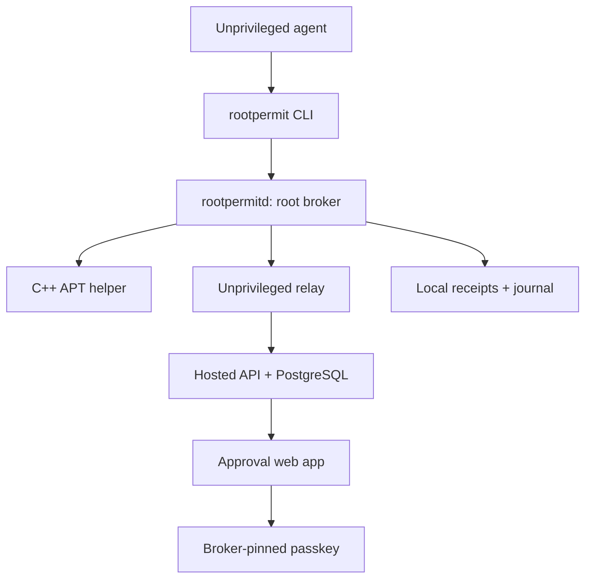
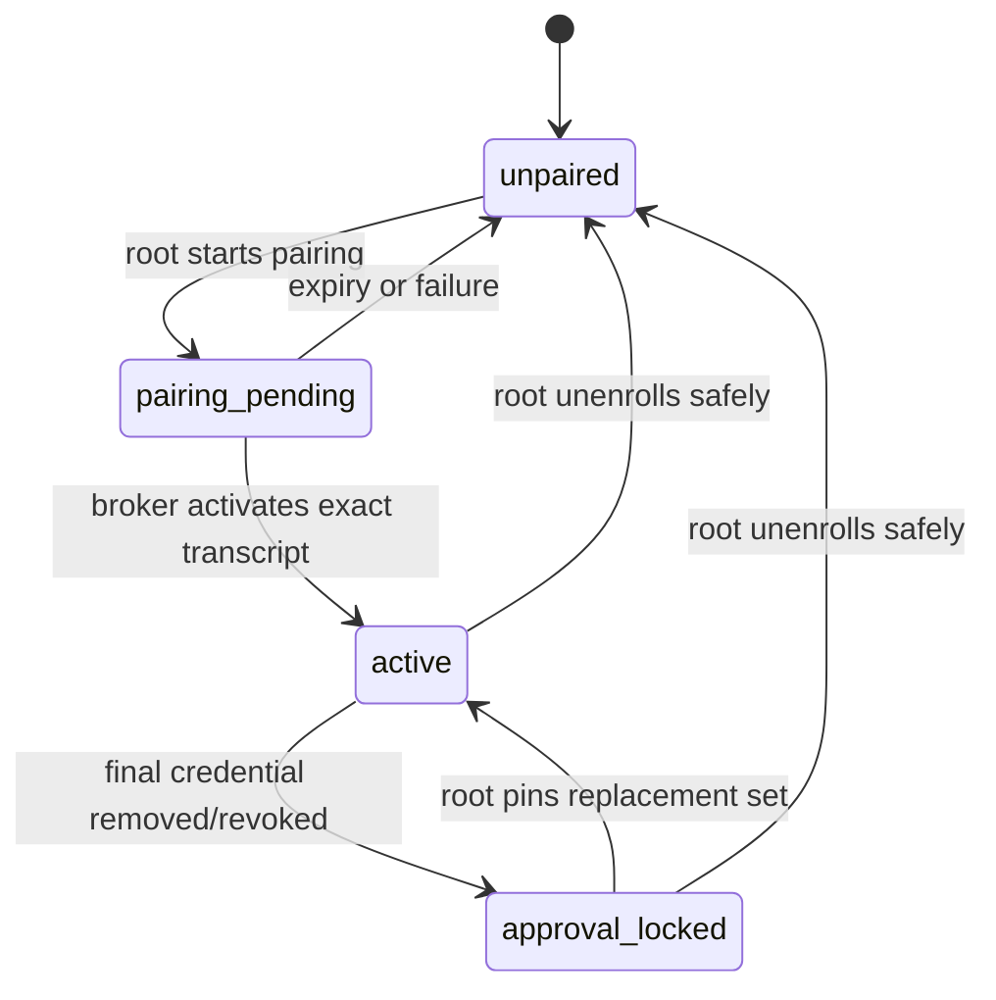
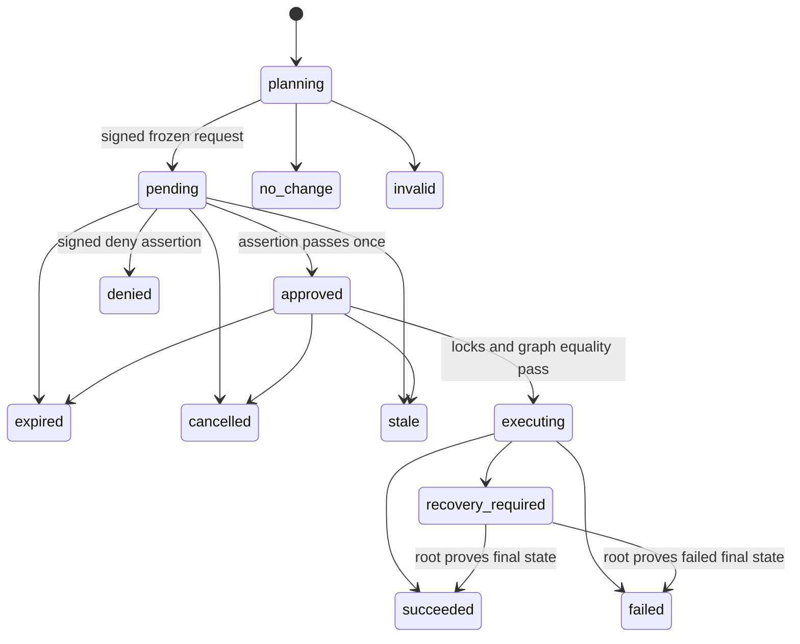
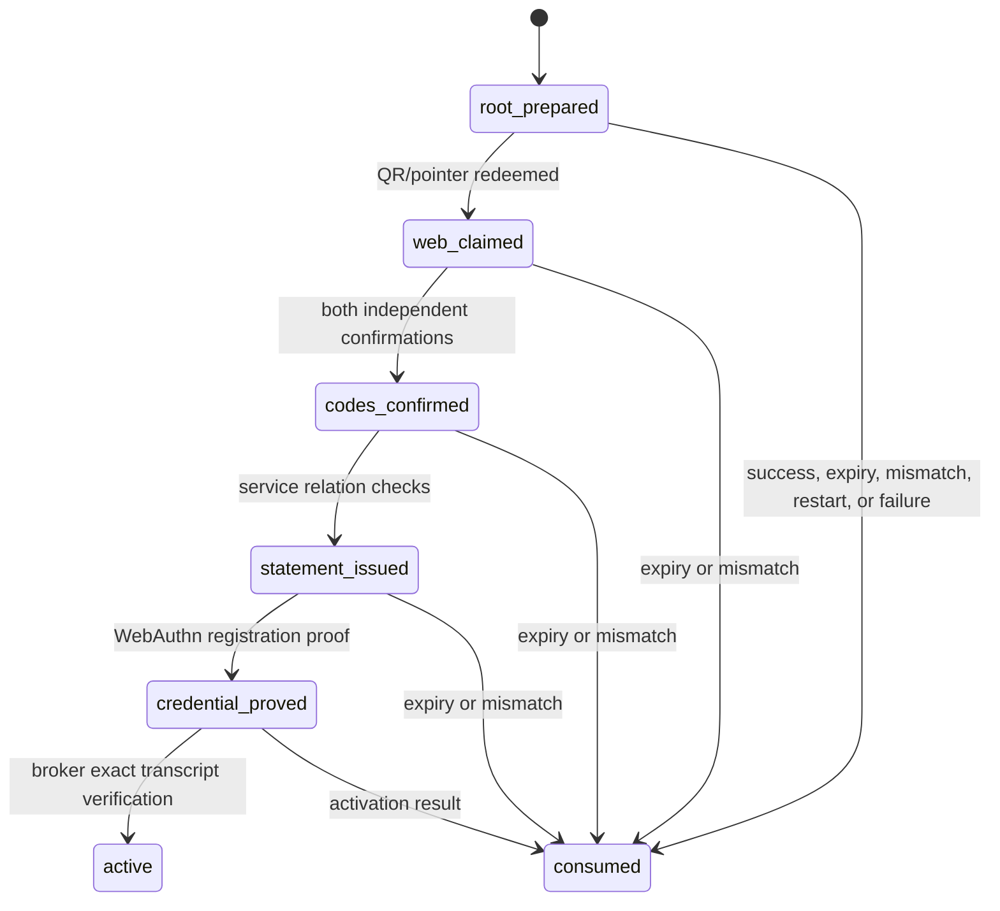
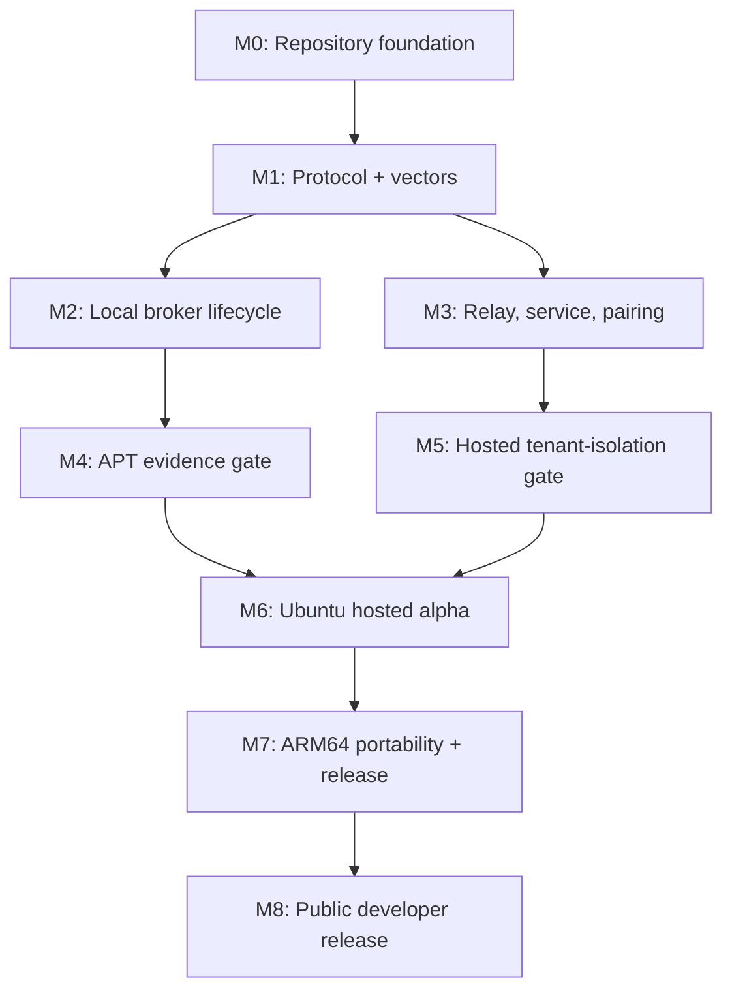

# RootPermit Engineering Specification v2

**Status:** implementation-ready; authorization and public-alpha promotion remain gated by the evidence in this document  
**Date:** 2026-08-12  
**Supersedes:** v1 as the implementation plan. All v1 security decisions remain normative unless this document explicitly says otherwise.  
**Product scope:** one typed `package.install` transition on Debian-family Linux only.  
**Reference environments:** Ubuntu Server 26.04 LTS AMD64 alpha; Raspberry Pi OS ARM64 portability gate.  
**Audience:** the engineering team or coding agent creating the first RootPermit repository.

## 1. Purpose and implementation contract

RootPermit lets an unprivileged agent request installation of exactly one native-architecture Debian package without receiving a root shell, sudo token, reusable credential, arbitrary command capability, or an elevated session. The root-owned broker freezes the exact package transition, a person approves or denies that one frozen transition through a broker-pinned passkey, and a narrow package helper executes only the proved-equal transition.

This document makes the previously closed v1 protocol and evidence decisions buildable. It defines the component boundaries, code modules, durable state, API contracts, failure behavior, tests, and incremental delivery plan. It is deliberately a single vertical slice. It is not a generalized authorization framework.

### 1.1 Normative language

The keywords **MUST**, **MUST NOT**, **SHOULD**, and **MAY** are requirements. A gate marked **blocking** prevents the named milestone from shipping. An implementation detail not marked normative can be changed only if its tests and security boundary are preserved.

### 1.2 Frozen decisions inherited from v1

| Area | v2 rule |
|---|---|
| Canonical protocol | Deterministic CBOR, exact v1 schemas, unknown-field rejection, SHA-256 digests, and COSE_Sign1. |
| Broker identity | One root-local Ed25519 key per broker, COSE `alg=-8`, protected `kid`. |
| Approval binding | Broker nonce plus canonical approval context; passkeys sign distinct approve and deny contexts. |
| Expiry | Broker monotonic deadline tied to the running boot; reboot expires non-executing work. |
| Revocation | Prospective service quarantine; broker acknowledgement advances credential generation; executing work continues. |
| Service proofs | Pinned offline service root, rotating role-scoped online signing keys. |
| APT | Content-addressed sealed inputs; C++ `libapt-pkg` helper; locks, re-simulation, exact action-graph equality, then execution. |
| WebAuthn | ES256 only, user verification required, no attestation trust, explicitly broker-pinned credentials. |
| Hosted authority | The service coordinates and renders. It is never a root principal and cannot construct an execution-capable approval. |
| Tenant isolation | Immutable server-derived tenant context, relationship authorization, PostgreSQL RLS, and property/integration proof. |

### 1.3 Explicit exclusions

- No remote shell, command text, scripts, systemd operations, file writes, repository/key changes, local `.deb`, URLs, source packages, foreign architectures, package versions, or APT flags supplied by an agent.
- No self-hosting promise, hosted-service compatibility layer, or operational support for forks.
- No guaranteed remote cancellation. Revocation and cancellation do not interrupt `executing` work.
- No automatic reconciliation or replay after a package-manager crash.
- No push notification requirement in the alpha. The website uses authenticated polling first; push is an additive later feature.

## 2. Reference implementation and repository layout

The reference implementation uses Rust for memory-safe edge components and shared protocol code, a narrow C++ helper solely because `libapt-pkg` is a C++ API, TypeScript for the hosted service and web app, PostgreSQL as the only authoritative hosted database, and a transactional outbox for asynchronous work. Redis, Kubernetes, and a separate queue are intentionally absent from the alpha; each adds another tenancy and recovery boundary before it is needed.

```text
rootpermit/
  crates/
    rp-protocol/             deterministic-CBOR schemas, COSE, vectors
    rp-web-authn/            assertion parsing/verification adapter
    rp-broker-core/          lifecycle, policy, planner, receipt service
    rp-broker-api/           Unix-socket RPC server/client types
    rp-relay/                unprivileged outbound transport and spool
    rp-cli/                  requester CLI and root administration CLI
    rp-testkit/              fixture builders, fake clocks, hostile peers
  helper/
    apt-helper/              C++20, libapt-pkg, no command-line API
  service/
    api/                     TypeScript service, REST + polling endpoints
    worker/                  transactional-outbox worker
    web/                     TypeScript approval application
    migrations/              PostgreSQL schema, RLS, roles, policies
  protocol-vectors/          versioned CBOR/COSE/WebAuthn/fixture corpus
  fixtures/
    ubuntu-amd64/            pinned image and APT fixture definitions
    rpi-arm64/               pinned image and APT fixture definitions
  docs/
    threat-model.md
    runbooks/
    api/
```

No crate or package outside `helper/apt-helper` may link to `libapt-pkg`. No process outside `rp-broker-core` may open the broker state database for mutation. No service package may possess a broker private key or direct inbound route to the device.

## 3. Component and deployment architecture



### 3.1 Local processes

| Process | Unix account / permissions | Starts | Responsibilities | Must not do |
|---|---|---|---|---|
| `rootpermitd` | `root`; state directory `0700` | systemd | Peer authorization, policy, planning, protocol signing/verification, lifecycle transaction, receipt signing, helper supervision, relay mailbox handoff | Network I/O, parse agent strings beyond the typed request, execute shell text |
| `rootpermit-apt-helper` | invoked by broker; setuid is forbidden | broker only | Validate sealed FDs and manifest, lock APT/dpkg, re-simulate, compare, execute, journal progress | Accept argv/paths/env from a caller, use live APT lists/cache/network |
| `rootpermit-relay` | `rootpermit-relay`; no broker state write access | systemd | TLS outbound connection/polling, opaque envelope delivery, retry/spool, liveness | Sign broker data, verify approval assertions, make lifecycle choices |
| `rootpermit` | requester UID | interactive/agent | Unix-socket client; emits JSON result to the caller | Read other UID requests or root state |
| `rootpermit-admin` | root console/SSH only | interactive | Pairing, credential change, local recovery, export, purge, unenroll | Bypass the broker lifecycle transaction |

`rootpermitd` exposes `/run/rootpermit/broker.sock` owned by `root:rootpermit`, mode `0660`. The CLI connects only through this socket. The broker obtains `SO_PEERCRED` and treats `uid`, `gid`, and process ID as kernel assertions; no RPC field may override them. The agent integration uses the CLI, not a writable config file or socket proxy.

### 3.2 Privilege handoff to the helper

The broker creates a sealed plan directory and opens it itself. It passes only inherited file descriptors over a `SOCK_SEQPACKET` socketpair:

| FD | Purpose | Required properties |
|---|---|---|
| 3 | broker-helper control socket | `SOCK_SEQPACKET`, peer credential must be root broker PID/start-time identity |
| 4 | read-only plan root directory | opened beneath `/var/lib/rootpermit/plans`, `O_DIRECTORY|O_NOFOLLOW` |
| 5 | append-only journal directory | root-owned, no caller path resolution |
| 6 | read-only content store root | root-owned, immutable objects only |

The fixed executable receives no arguments after its program name. The broker starts it with an empty environment except `LANG=C`, a fixed `PATH` that the helper never executes from, and a stable helper protocol version. `NoNewPrivileges`, no writable home, private `/tmp`, and restrictive systemd filesystem settings are mandatory. The helper must reject a missing, additional, or unexpected FD.

### 3.3 Hosted deployment

The first hosted deployment contains three stateless services behind the official approval origin:

| Service | Access | Database role | Responsibility |
|---|---|---|---|
| API | public HTTPS | `rp_api` with RLS | Account session, pairing mailbox, opaque envelopes, decision submission, reads, revocation request |
| Worker | private | `rp_worker` with RLS plus narrowly scoped outbox functions | Notification, expiry cleanup, projection retries, exports, deletion requests |
| Key signer | private network only | no application-data role; calls a narrow stored-procedure/API facade | Signs enrollment, acceptance, revocation, and keyset objects after relation checks |

The web app is static/SSR content served from the same official HTTPS origin. It calls the API only with a normal account session and never gets a service signing key. The relay makes only outbound TLS connections; no device accepts internet-initiated traffic.

Production uses one PostgreSQL primary with point-in-time backup enabled. The service account roles may not use a table-owning or RLS-bypassing superuser connection. Migrations run through a separately audited deploy role. Secrets are injected at runtime; they never appear in browser bundles, logs, protocol vectors, or database rows.

## 4. Data model and durable storage

### 4.1 Identifier, time, and retention conventions

- Public identifiers are 16 random bytes rendered as lowercase base64url without padding. They are opaque and never sequential.
- Internal primary keys are UUIDs or bigint values and are never returned to clients.
- UTC timestamps are RFC 3339 with millisecond precision for display/audit. Broker monotonic time is the sole request-expiry authority.
- Local authoritative records are retained 90 days by default; hosted terminal projections 30 days by default. Active/recovery evidence is never age-deleted.
- Every record that influences authorization is append-only or has an append-only audit/event companion.

### 4.2 Local SQLite schema

The broker uses a single SQLite database at `/var/lib/rootpermit/state.db`, opened only by `rootpermitd`, with WAL mode, `synchronous=FULL`, foreign keys on, and an explicit transaction around each state transition. The content store and plan directories are not database blobs.

| Table | Key columns | Invariants |
|---|---|---|
| `broker_identity` | `device_id`, `broker_epoch`, `key_kid`, encrypted/private-key reference, `boot_id` | exactly one active row; private key is root-readable only |
| `device_binding` | device name, service account subject hash, official origin, RP ID, enrollment state | only `active`, `approval_locked`, `unpaired` allowed |
| `credentials` | credential ID, COSE key, generation, status, transports, backup flags, sign count | 1-5 active unique credentials when device `active` |
| `requests` | request ID, requester UID, operation key, plan digest, generation, state, monotonic deadline, terminal receipt ID | unique `(requester_uid, operation_key)`; at most one non-terminal request per device |
| `request_events` | request ID, sequence, previous event hash, transition, signed envelope | unique `(request_id, sequence)`; append only |
| `plans` | handle, digest, manifest digest, root FD-independent path, state fingerprint | write once; referenced by one request |
| `execution_journal` | request ID, marker sequence, helper identity, phase, payload digest | append only; no inferred success |
| `receipts` | receipt ID, request ID, terminal state, signed envelope | exactly one terminal receipt per request |
| `relay_outbox` | envelope ID, kind, attempts, next attempt, payload blob | opaque signed bytes; idempotent delivery key |
| `idempotency` | requester UID, operation key, request ID, input digest | input mismatch is a terminal conflict |
| `audit_events` | actor kind, actor ID, action, safe metadata digest | immutable; secrets/assertions excluded |

The non-terminal uniqueness invariant is enforced by a partial unique index on a constant device key where `state IN ('planning','pending','approved','executing')`. A `BEGIN IMMEDIATE` transaction plus this index is the local serialization point. The broker never uses SQLite row contents as a substitute for the APT/dpkg locks.

### 4.3 Hosted PostgreSQL schema

Every listed table includes `tenant_id uuid not null`; database foreign keys must retain ownership paths. API queries set a verified transaction-local `app.tenant_id`; RLS policies compare it to the row's `tenant_id`. Client bodies cannot set or override it.

| Table | Primary relationship | Important fields |
|---|---|---|
| `accounts` | tenant root | `tenant_id`, account public ID, email-verification state, disabled state |
| `web_sessions` | account | tenant, expiry, authentication strength, recovery hold |
| `devices` | tenant -> broker identity | public device ID, broker key KID/public key, projection state, enrollment state |
| `credential_bindings` | device | credential ID digest, public COSE key, generation, quarantine status |
| `pairings` | device provisional | nonce digest, comparison-code digest, expiry, root/browser confirmations |
| `request_envelopes` | device | public request ID, broker COSE bytes, digest, terminal flag, created/expiry display time |
| `decisions` | request envelope | decision public ID, credential binding, assertion bytes reference, decision value, verification result |
| `service_proofs` | request/device | COSE acceptance/revocation/enrollment proof, signer KID, sequence/cutoff |
| `lifecycle_projections` | request envelope | broker sequence, event digest, state, frozen flag on gap |
| `receipt_projections` | request envelope | broker receipt COSE bytes, terminal state, completed time |
| `outbox` | tenant | event type, relation type/id, payload digest, attempts, visible-after time |
| `notifications` | account/device/request | channel, delivery state, idempotency key, safe template data |
| `audit_events` | tenant | actor, relation, action code, safe metadata |
| `exports`, `deletion_requests` | tenant | scope, state, expiry, audit relation |

The unique indexes include `(tenant_id, public_id)` for exposed IDs and relationship-specific keys. A lookup by bare public request ID is forbidden in repository code. The database role has no generic `SELECT` privilege outside stored repository functions, and every function takes the transaction tenant context rather than a client-supplied tenant parameter.

### 4.4 Canonical protocol schemas

All integer field maps below are exact v1 schemas. Values use canonical CBOR types. `b16`, `b32`, and `b64` mean exact byte lengths. `t` means bounded UTF-8 text. Required fields are all fields shown unless marked optional. No v1 message permits unknown keys.

| Type | Integer-keyed fields |
|---|---|
| `Request` | `1:v`, `2:request_id b16`, `3:device_id b16`, `4:broker_epoch u`, `5:generation u`, `6:created_utc i`, `7:expires_utc i`, `8:boot_id b16`, `9:deadline_mono_ns u`, `10:nonce b32`, `11:requester_uid u`, `12:operation u=1`, `13:operation_input`, `14:policy_id b16`, `15:policy_digest b32`, `16:plan_digest b32`, `17:frozen_plan`, `18:agent_note? t<=512` |
| `ApprovalContext` | `1:v`, `2:request_id`, `3:device_id`, `4:broker_epoch`, `5:request_digest b32`, `6:generation`, `7:nonce`, `8:rp_id t<=253`, `9:origin t<=255`, `10:decision u(1 approve,2 deny)`, `11:expires_utc` |
| `DecisionSubmission` | `1:v`, `2:approval_context`, `3:credential_id bytes<=1024`, `4:authenticator_data bytes<=512`, `5:client_data_json bytes<=4096`, `6:signature bytes<=512`, `7:user_handle? bytes<=256` |
| `PlanManifest` | `1:v`, `2:plan_digest`, `3:inputs[]`, `4:action_graph`, `5:policy_digest`, `6:created_utc`, `7:toolchain`, `8:prestate_observation` |
| `LifecycleEvent` | `1:v`, `2:request_id`, `3:seq u`, `4:prev_event_digest b32?`, `5:request_digest`, `6:broker_epoch`, `7:transition u`, `8:occurred_utc`, `9:detail_code u`, `10:detail_digest? b32` |
| `Receipt` | `1:v`, `2:receipt_id b16`, `3:request_id`, `4:request_digest`, `5:plan_digest`, `6:terminal_state u`, `7:authorization_evidence[]`, `8:prestate_evidence`, `9:execution_evidence`, `10:created_utc`, `11:completed_utc`, `12:broker_epoch` |
| `EnrollmentStatement` | `1:v`, `2:tenant_subject_digest b32`, `3:device_id`, `4:broker_pubkey b32`, `5:credential_set[]`, `6:pairing_nonce b32`, `7:comparison_digest b32`, `8:rp_id`, `9:origin`, `10:next_generation`, `11:expires_utc` |
| `ServiceKeyset` | `1:v`, `2:keyset_version u`, `3:issued_utc`, `4:keys[]`, `5:root_kid`, `6:expires_utc` |
| `RevocationEvent` | `1:v`, `2:device_id`, `3:credential_id`, `4:cutoff_utc`, `5:service_event_id b16`, `6:generation_at_issue`, `7:reason_code u` |

`FrozenPlan` comprises: `package_actions[]`, repository identities, total archive bytes, total installed delta, zero removals, zero downgrades, plan warnings, and manifest digest. Each `package_action` holds package name, native architecture, installed version, target version, action enum, origin identity, `.deb` SHA-256, archive/installed size, and dependency parent indexes. The plan encoder MUST sort actions by package name then architecture then target version before encoding.

### 4.5 Receipt evidence requirements

Every terminal receipt commits to the original request digest and must include the terminal result truthfully:

| Terminal state | Required receipt evidence |
|---|---|
| `no_change` | installed version observation and plan/no-change reason |
| `invalid` | named policy/validation failure and safe rejection details |
| `denied` | signed deny assertion digest and verifier result |
| `expired`, `cancelled`, `stale` | final lifecycle event and winning transition reason |
| `succeeded` | approval evidence, manifest/action graph, prestate observation, helper journal digest, final package-state observation |
| `failed` | approval evidence if reached, failing phase/code, final observed state, no rollback claim |
| `recovery_required` | last durable journal point, unknowns, current package-state observation, required root action |

## 5. State machines and concurrency rules

### 5.1 Device binding state



Only a root console/SSH operation may enter `pairing_pending`, replace credentials, unlock `approval_locked`, or reach `unpaired`. Hosted actions can request only credential quarantine/revocation. No browser flow changes this state itself.

### 5.2 Request lifecycle



Exactly one operation wins among `approved -> executing`, local `cancel`, expiry, and a credential-generation change. The broker holds the per-device transaction and uses compare-and-set on expected state/generation. The winner appends the event, writes any receipt if terminal, and commits atomically. The relay may duplicate events; the service de-duplicates using `(device_id, request_id, sequence, event_digest)`.

### 5.3 Pairing state



The pairing nonce has one write-once consumed record. A second redemption, different device/broker key, missing root confirmation, missing web confirmation, comparison mismatch, wrong origin/RP ID, expired statement, or credential mismatch consumes the pairing and requires a new root-started flow.

### 5.4 Hosted projection state

The hosted request projection is `awaiting_event`, `pending`, `approved`, `executing`, terminal, or `frozen_gap`. It never chooses an authoritative transition. An event whose sequence is the expected successor applies in one transaction. A duplicate matching an applied digest is ignored. A duplicate with different bytes or any gap changes the projection to `frozen_gap`, creates an outbox resync request, and blocks user action until a verified contiguous chain arrives.

### 5.5 Execution and crash state

`execution_started` is durable before helper work. The helper journals `inputs_verified`, `locks_acquired`, `graph_equal`, `apt_started`, `archives_unpacked`, `packages_configured`, `triggers_completed`, and `final_state_observed` as applicable. A process death, reboot, missing marker, or interrupted journal never causes automatic execution/retry. On restart, the broker reports `recovery_required` unless it can prove exact intended final state or a proved failure.

## 6. API and RPC contracts

### 6.1 Local Unix-socket RPC

The local protocol is length-prefixed CBOR over `SOCK_SEQPACKET`. Each message has `request_id` at transport level for correlation, a method enum, and a body. Transport errors never disclose foreign request existence. CLI output is JSON for automation and human-readable only when explicitly requested.

| Method | Caller | Input | Success | Main errors |
|---|---|---|---|---|
| `SubmitPackageInstall` | peer UID | `operation_key`, `package_name`, optional untrusted note | request summary or terminal receipt | `invalid_input`, `not_allowed`, `busy`, `idempotency_conflict`, `approval_locked` |
| `GetRequest` | original peer UID/root | public request ID | caller-scoped projection | `not_found_or_not_authorized` |
| `ListRequests` | peer UID/root | bounded limit <=100, opaque cursor | caller-scoped page | `invalid_cursor`, `not_found_or_not_authorized` |
| `CancelRequest` | original peer UID/root | public request ID | current state / terminal receipt | `cancellation_too_late`, `not_found_or_not_authorized` |
| `GetReceipt` | original peer UID/root | public receipt/request ID | signed receipt bytes + projection | `not_found_or_not_authorized` |
| `RootStartPairing` | root | device display name | local QR/pointer and comparison code | `device_not_unpaired`, `temporarily_unavailable` |
| `RootChangeCredentials` | root | add/replace/remove intent | pairing/credential-change transcript | `credential_limit_reached`, `unsafe_lifecycle_state` |
| `RootReconcile` | root | request ID, signed operator outcome evidence | reconciled receipt | `not_recovery_required`, `reconciliation_not_proved` |
| `RootExport`, `RootPurge`, `RootUnenroll` | root | bounded scope | signed result | `unsafe_lifecycle_state`, `retention_protected` |

`SubmitPackageInstall` accepts a package grammar matching Debian binary package names only: lowercase ASCII letters/digits plus `+`, `-`, `.`, and a single allowed colon only where the native architecture expression is broker-derived. The external caller provides only the base package name, 2-64 bytes. Any server-supplied description is stored/rendered as untrusted and excluded from all signed authority fields.

Example CLI contract:

```json
{"operation_key":"8d5c...","package_name":"ffmpeg","note":"Need media inspection"}
```

```json
{"code":"pending_approval","retryable":false,"request_id":"vXQ...","state":"pending","expires_at":"2026-08-12T...Z","request_digest":"64f0...a912"}
```

### 6.2 Broker-relay mailbox protocol

The relay sends opaque CBOR/COSE objects over HTTPS. Every delivery has a 16-byte envelope ID and a direction-specific idempotency key. The relay persists outbound envelopes before sending and deletes them only after an authenticated service acknowledgement. The service never assumes an acknowledgement means the broker has executed anything.

| Direction | Object kinds | Delivery semantics |
|---|---|---|
| broker -> service | enrollment acknowledgement, request, lifecycle event, receipt, keyset acknowledgement | at-least-once transport, idempotent content application |
| service -> relay -> broker | service keyset, decision submission/proof, revocation event, resync request | at-least-once transport, broker de-duplicates and independently verifies |

The HTTPS request includes device public ID and envelope ID only as routing hints. The signed object remains the authority. A malformed or foreign object receives a generic 202/404-shaped response at the service boundary and a precise local audit code only where it is safe to expose one.

### 6.3 Hosted REST API

All endpoints are under the official approval origin, require HTTPS, send `Cache-Control: no-store` for authenticated/approval responses, and return RFC 7807-style bounded error JSON. User-facing endpoints derive tenant/session server-side.

| Endpoint | Auth | Purpose | Invariant |
|---|---|---|---|
| `POST /v1/account/session` | account authentication | establish website session | session cannot imply approval authority |
| `POST /v1/pairings/{id}/claim` | account session | claim a root-created pointer | does not activate device |
| `POST /v1/pairings/{id}/confirm` | account session | record displayed-code confirmation | exact pairing tenant/device relation |
| `GET /v1/requests/{id}` | tenant session | fetch verified broker envelope/projection | server verifies tenant and device relation before lookup |
| `POST /v1/requests/{id}/decisions` | tenant session + WebAuthn | submit assertion/context | service verifies route relation and rejects quarantined credentials; broker is final verifier |
| `GET /v1/requests/{id}/status` | tenant session | polling status/receipt projection | no cache/shared URL leakage |
| `POST /v1/credentials/{id}/revocations` | tenant session | request authority reduction | quarantines immediately; cannot modify broker generation |
| `GET /v1/devices` | tenant session | list own device projections | no global device lookup |
| `POST /v1/exports`, `POST /v1/deletion-requests` | tenant session | hosted data controls | cannot erase local authority/history |
| `POST /v1/relay/inbox`, `GET /v1/relay/outbox` | mutually authenticated relay session | opaque mailbox | no direct execution route |

The decision endpoint validates the CBOR shape, assertion byte limits, correct request/device tenant relation, and current service-side quarantine/cutoff before issuing any service acceptance proof. It does not decide that the assertion authorizes root work; it cannot manufacture a `DecisionSubmission` and cannot change a broker record.

### 6.4 Approval web behavior

The web app must verify the broker COSE envelope in a shared, tested TypeScript/WASM verifier before rendering authoritative content. It displays package target, dependencies, removals, downgrades, origin, archive/disk impacts, device, policy, request digest, and expiry. Untrusted agent text is visually separated and cannot overwrite/precede consequences.

Approve and deny both create their own `ApprovalContext`; deny triggers the same user-verification WebAuthn ceremony and yields a signed audit outcome. The site must never use a challenge supplied in an unverified request body, route parameter, notification payload, local storage, or service projection. The assertion request uses exactly the broker-pinned credential IDs for the target device.

## 7. Error taxonomy and recovery contract

Every local and hosted error has a stable machine code, a safe bounded user message, a retryability class, an owning component, and an audit code. Raw APT output, cryptographic parser errors, tokens, assertions, and agent text must not appear in client errors or metrics labels.

| Family | Code | Retry | Owner recovery |
|---|---|---|---|
| Intake | `invalid_input`, `not_allowed`, `unsupported_operation`, `policy_denied` | never | agent changes typed input or root changes policy |
| Intake | `busy`, `storage_limit`, `temporarily_unavailable` | bounded | caller retries with backoff; broker exposes `retry_after` where known |
| Intake | `idempotency_conflict` | never | caller chooses a new operation key only for a genuinely new request |
| Visibility | `not_found_or_not_authorized`, `invalid_cursor` | never | caller uses own scoped ID/cursor; no existence disclosure |
| Device | `device_unpaired`, `approval_locked`, `credential_recovery_required` | never until root action | root starts pairing/recovery; account cannot repair authority |
| Protocol | `protocol_mismatch`, `invalid_envelope`, `invalid_signature`, `unknown_key`, `invalid_keyset` | never for object | update compatible component or investigate signed keyset |
| Approval | `request_expired`, `request_not_pending`, `decision_replayed`, `decision_context_mismatch`, `credential_not_pinned`, `credential_quarantined` | never | submit a new request or root completes credential recovery |
| WebAuthn | `webauthn_origin_mismatch`, `webauthn_rp_id_mismatch`, `webauthn_uv_missing`, `webauthn_signature_invalid` | never for assertion | user reopens official origin and retries new ceremony |
| WebAuthn | `counter_anomaly` | decision may continue | record warning, notify, recommend root-controlled credential replacement |
| Lifecycle | `cancellation_too_late`, `generation_stale`, `lifecycle_race_lost`, `sequence_gap` | context dependent | show winning terminal state; resync broker projection for gap |
| APT plan | `artifact_drift`, `prestate_drift`, `apt_lock_unavailable`, `unsupported_apt_behavior`, `plan_manifest_invalid` | new request after remediation | broker keeps original evidence; never silently re-resolves |
| Execution | `execution_failed`, `helper_protocol_violation`, `helper_crashed`, `recovery_required` | no automatic retry | root reads receipt/journal and runs reconciliation |
| Hosted | `tenant_boundary_denied`, `rate_limited`, `service_unavailable`, `mailbox_backlog` | bounded except boundary | service retries outbox; user gets no cross-tenant detail |
| Admin | `unsafe_lifecycle_state`, `retention_protected`, `reconciliation_not_proved` | never until state changes | root waits, provides proof, or completes manual recovery |

### 7.1 Retry policy

Only transport, mailbox, lock, and declared capacity failures are retryable. Retryable responses carry `retry_after_ms` clamped to 1 second-5 minutes. The CLI uses exponential backoff with full jitter and a default 2-minute ceiling, but never reuses an operation key with different input. The broker never retries an approval or helper execution after a process crash.

### 7.2 Recovery runbooks

| Situation | System behavior | Operator action |
|---|---|---|
| Relay offline | broker retains signed outbox; no approval can arrive until connectivity returns | restore egress; do not copy envelopes by hand |
| Service unavailable | pending request naturally expires locally; relay retries mailbox | wait or submit a new request after service recovery |
| Lost CLI response | idempotency mapping returns original request/receipt | repeat exact operation key and input |
| Credential lost | service revocation reduces authority; final loss locks device | root starts credential-recovery pairing, then pins replacement |
| Broker restart | all pending/approved work expires; executing work is reconciled | inspect signed receipt/recovery status; submit fresh request if needed |
| Helper/host crash | no automatic replay; state becomes `recovery_required` unless final state is proved | root runs `rootpermit-admin reconcile` and records evidence |
| APT drift/lock | no mutation occurs | settle external APT activity; request and approve a newly frozen plan |
| Projection gap | service freezes display/action, requests signed replay | relay/broker resynchronizes from exact event sequence |
| Suspected tenant escape | deny request, preserve audit, page security owner | disable affected service route/job, run isolation regression, rotate affected credentials if needed |

## 8. Threat model and test matrix

### 8.1 Assets, actors, and trust boundaries

| Asset | Threat actors | Boundary / mitigation |
|---|---|---|
| Root execution authority | agent, requester UID, relay, network | root-only broker lifecycle; typed input; private Unix socket; no reusable token |
| Frozen APT consequence | agent, host cache changes, other package manager, malicious paths | sealed manifest/store, helper FD contract, locks, re-solve/equality proof |
| Human decision | network, replay attacker, wrong account credential, service data bug | exact approval context, broker nonce, WebAuthn UV/origin/RP checks, one-time CAS |
| Credential lifecycle | account takeover, lost phone, service compromise | root-only authority addition; account only reduces authority; generation boundary |
| Tenant data | another tenant, confused worker/cache/websocket/support flow | derived tenant context, relationship checks, RLS, tenant-prefixed every async/storage path |
| Honest evidence | crash, compromised relay, event reorder | append-only local journal/events, COSE receipts, projection gap freeze |

The official approval website and deployment pipeline are trusted MVP components. A compromise there can mislead the human about what was rendered. This residual risk is documented, not hidden; it is outside the security claim of the v1 vertical slice.

### 8.2 Required security regression matrix

| ID | Attack / failure | Test level | Pass criterion | Blocking gate |
|---|---|---|---|---|
| TM-01 | Agent supplies shell/URL/version/flag/path | broker unit + socket integration | input rejected before planning; no helper invocation | M2 |
| TM-02 | Cross-UID request read/list/cancel | socket integration | generic denial and no count/timing existence leak | M2 |
| TM-03 | Duplicate operation key, changed input | broker unit | original mapping retained; `idempotency_conflict` | M2 |
| TM-04 | CBOR alternate encoding/unknown/duplicate field | protocol vectors | verifier rejects before signature/lifecycle use | M1 |
| TM-05 | COSE wrong alg/kid/protected header/payload | protocol vectors | reject before render/broker acceptance | M1 |
| TM-06 | Replay/approve-to-deny/context substitution | WebAuthn vectors + broker integration | exactly one matching decision may transition state | M2 |
| TM-07 | Wrong origin/RP ID/no UV/unpinned credential | WebAuthn integration | broker rejects and remains pending or expires | M2 |
| TM-08 | Revoke/generation/cancel/expiry races | deterministic concurrency tests | one durable winner; no post-winner execution | M2 |
| TM-09 | Pairing QR replay/browser-only enrollment | transcript integration | pairing consumed; no active device/credential | M3 |
| TM-10 | Final passkey revocation/account recovery | integration | device locks; account cannot restore authority | M3 |
| TM-11 | Metadata/archive/hardlink/symlink/env/argv swap | helper adversarial fixture | failure before package mutation | M4 |
| TM-12 | Live cache/network/package-manager drift | helper fixture on reference image | exact equality or `prestate_drift`; no download | M4 |
| TM-13 | APT hooks/triggers and crash at every marker | fault injection fixture | proven result or `recovery_required`, never false success | M4 |
| TM-14 | Tenant/public-ID/cache/queue/websocket substitution | property + API/worker integration | tenant B cannot observe or mutate A through every listed path | M5 |
| TM-15 | RLS disabled/application guard disabled | mutation test | remaining layer catches foreign relation attempt where applicable | M5 |
| TM-16 | Log/export/backup/support data leak | integration and snapshot tests | no foreign content, assertion, token, or raw agent text | M5 |
| TM-17 | Relay duplicate/reorder/drop | network simulation | broker authority correct; service freezes/resyncs gap | M3 |
| TM-18 | Dependency/CVE/toolchain regression | CI supply-chain checks | lockfiles/SBOM/provenance policy passes | M8 |

### 8.3 Test pyramid and CI lanes

| Lane | Runs | Required content |
|---|---|---|
| Fast PR | every change | Rust/TS/C++ formatting, lint, unit tests, protocol vectors, migration/RLS static checks |
| Integration PR | changes to state/API/service | Unix-socket peer tests, PostgreSQL RLS/property suite, service-web contract tests, relay simulation |
| Privileged nightly | isolated VMs | APT fixture subset, crash/lock/network isolation, Ubuntu image verification |
| Release candidate | pinned Ubuntu and ARM64 | full APT matrix, end-to-end pairing/approval/receipt, upgrade/uninstall, SBOM/provenance |
| Manual security review | before public alpha/release | threat model review, privileged code diff review, dependency/license review, deployment/runbook exercise |

Test fixtures may not use production credentials, account data, or mutable repository metadata. Every discovered bypass becomes a named regression test in this matrix before the affected milestone reopens.

## 9. Observability, privacy, and operations

### 9.1 Required signals

The broker and service emit structured events with public device/request/receipt IDs, state, stable error code, correlation ID, and duration. They must not emit private keys, WebAuthn assertion bytes, pairing secrets, email recovery tokens, full agent text, APT command lines, archive paths, or foreign-tenant data.

Required metrics: lifecycle transition count/latency, approval delivery latency, expiry/denial/cancel/stale rate, named-error count, helper failures, APT lock/drift failures, recovery-required age, relay backlog, projection gaps/resync, WebAuthn failure classes, credential quarantine rate, tenant-denial count, notification outcome, outbox lag, storage quota, backup/restore test result, deployment/rollback audit result.

### 9.2 Audit event format

Each audit event contains `event_id`, UTC time, actor kind/public ID, tenant/device/request relation where authorized, action code, result code, and a SHA-256 digest of bounded safe metadata. The event body must be sufficient to correlate a receipt without becoming an alternative source of privileged truth.

### 9.3 Service operations

- Deploy API, worker, signer, and web independently with immutable build IDs and rollback to a previously verified image.
- Run database migrations as expand/contract changes. A migration must not remove a column or RLS policy until all code paths no longer use it and a rollback window passes.
- Keyset rotation adds a new online key, publishes root-signed keyset, waits for relay acknowledgements/expiry policy, then retires old signing use. A service root change needs a broker software release.
- Test restore into an isolated tenant/database. A restore never creates broker authority or triggers relay delivery.
- Incident response for suspected hosted compromise prioritizes stopping acceptance/notification, preserving audit evidence, rotating service online keys, and communicating that executing broker operations are not remotely cancellable in v1.

## 10. Milestones and implementation backlog

### 10.1 Delivery rules

Each work item has an owner role, concrete output, tests, and exit criterion. No work item may be marked done on a UI demo or compiling interface alone. Items marked `BLOCKING` must close before their downstream milestone begins. Estimates are implementation sequencing, not calendar promises; dependencies are the source of truth.



### M0. Repository foundation and development contract

**Goal:** make every later privileged/security change reviewable and reproducible.

| ID | Work item | Depends on | Acceptance criteria |
|---|---|---|---|
| M0-01 | Create monorepo layout, Rust workspace, TS workspaces, CMake helper target | none | exact layout in section 2; CI can build empty targets on Linux |
| M0-02 | Pin toolchains and dependency policy | M0-01 | `rust-toolchain`, Node package manager lockfile, C++ compiler/libapt version declaration, license allowlist; CI rejects drift |
| M0-03 | Establish test harness and fixture contract | M0-01 | fake monotonic clock, deterministic RNG test adapter, temp root/state helpers, VM fixture manifest schema |
| M0-04 | Establish CI/security baseline | M0-02 | formatting/lint/unit lane, dependency scan, secret scan, SBOM generation, signed build provenance placeholder |
| M0-05 | Document development and threat-review rules | M0-01 | contributor guide requires privileged-boundary review and vectors for protocol changes |

**Exit:** a clean clone builds/lints/tests on Linux; no privileged feature is present.  
**Blocking:** M1, M2, M3, M4, M5.

### M1. Protocol library and conformance corpus

**Goal:** freeze executable bytes before any component can authorize work.

| ID | Work item | Depends on | Acceptance criteria |
|---|---|---|---|
| M1-01 | Implement bounded deterministic-CBOR codec/profile | M0 | accepts only defined types/limits; rejects non-canonical forms, duplicate/unknown keys, trailing bytes |
| M1-02 | Implement COSE_Sign1 Ed25519 and service-keyset verification | M1-01 | protected-header policy, external AAD domain labels, KID/role/validity checks covered by vectors |
| M1-03 | Implement exact schemas/digest builders | M1-01 | Request, plan, context, decision, event, receipt, enrollment, keyset, revocation maps round-trip exactly |
| M1-04 | Publish language-neutral vectors and negative corpus | M1-02,M1-03 | JSON manifest plus hex CBOR/COSE expected bytes/digests; Rust, TS, and C++ adapters consume same corpus |
| M1-05 | Implement WebAuthn verification adapter contract | M1-03 | test fixtures prove challenge/origin/RP/UV/ES256/credential selection checks; no custom crypto parser |
| M1-06 | Add protocol compatibility gate | M1-04,M1-05 | CI rejects schema change without version/vector update and rejects v1 unknown field acceptance |

**Exit:** all vectors pass in Rust and TypeScript; C++ helper reads only the manifest subset through a tested adapter.  
**Blocking:** no broker approval logic, hosted decision route, or pairing implementation can merge before M1 passes.

### M2. Local broker, requester isolation, and receipt lifecycle

**Goal:** prove the root-owned lifecycle locally with a fake execution adapter before APT.

| ID | Work item | Depends on | Acceptance criteria |
|---|---|---|---|
| M2-01 | SQLite store/migrations and state CAS | M1 | schema/invariants in 4.2; power-loss transaction tests; unique one-active-request constraint |
| M2-02 | Unix socket transport and peer-UID authorization | M0 | `SO_PEERCRED` required; cross-UID read/list/cancel tests have identical denial |
| M2-03 | Typed `package.install` intake/policy/idempotency | M2-01,M2-02 | all prohibited inputs rejected; repeat exact operation key recovers original result |
| M2-04 | Planner interface and deterministic fake planner | M1,M2-03 | broker can produce `no_change`, `invalid`, or signed `pending` plan without APT helper |
| M2-05 | Approval verifier/state-race engine | M1,M2-01 | one-time approve/deny/expiry/cancel/generation concurrency tests pass deterministically |
| M2-06 | Event chain and receipt generator | M2-05 | every terminal path yields one COSE receipt with required evidence fields |
| M2-07 | Root admin skeleton and recovery-state UX | M2-01 | root-only operations cannot be invoked by socket peer; operator sees honest `recovery_required` |

**Exit:** a local test harness can submit, approve/deny with vectors, cancel/expire/stale, and verify receipts without any real package mutation.  
**Blocking:** M4's helper may integrate only after this lifecycle owns execution authorization.

### M3. Relay, hosted control plane, pairing, and approval web

**Goal:** complete a disposable single-tenant end-to-end approval path while keeping broker authority local.

| ID | Work item | Depends on | Acceptance criteria |
|---|---|---|---|
| M3-01 | Unprivileged relay spool/mailbox protocol | M1,M2 | duplicate/drop/reorder simulator proves opaque at-least-once delivery and no relay authority |
| M3-02 | Hosted schema, RLS foundation, repository layer | M0,M1 | every table has tenant/relations/RLS; repository tests reject bare-ID lookup |
| M3-03 | Account sessions and official-origin configuration | M3-02 | account session distinct from approval credential; cache/no-store/CSP baseline documented |
| M3-04 | Root-started pairing transcript | M1,M2,M3-02 | all pairing failure/replay/browser-only vectors pass; only broker activation creates active device |
| M3-05 | Broker-pinned credential registration/change flow | M1,M2,M3-04 | one-five credential rules, ES256/UV proof, generation staling, `approval_locked` semantics pass |
| M3-06 | Verified request renderer and WebAuthn decision UI | M1,M3-03,M3-05 | UI verifies envelope before render; shows authoritative consequences; approve and deny sign separate contexts |
| M3-07 | Decision/revocation endpoints and service proofs | M1,M3-02,M3-06 | service rejects quarantined credentials, signs role-scoped proof, cannot manufacture authority; broker remains final verifier |
| M3-08 | Projection, polling, and resync flow | M3-01,M3-07 | sequence gap freezes page action and resync restores only verified contiguous events |

**Exit:** on disposable single-tenant data, a root-enrolled device shows a verified request on a phone, accepts a bound passkey decision, and returns a broker-signed fake-execution receipt.  
**Non-gate note:** this is a usability prototype only. It is not a hosted alpha until M5 passes.

### M4. APT sealed-plan evidence gate

**Goal:** prove or honestly narrow the exact-execution claim before real package authorization.

| ID | Work item | Depends on | Acceptance criteria |
|---|---|---|---|
| M4-01 | Content-addressed store and manifest writer | M1,M2 | root-owned immutable inputs, path/permission/hash verification, sealed plan FD handoff tests |
| M4-02 | C++ helper control protocol and sandbox | M4-01 | no user argv/env/path input; unexpected FD/peer/environment rejected; systemd sandbox regression tests |
| M4-03 | Private `libapt-pkg` simulation/action normalization | M4-02 | sealed source/list/archive/preferences/state view; normalized graph exact-byte comparison |
| M4-04 | Locking and execution path | M4-03 | APT/dpkg locks held through execute; no network/live cache; fake/real fixture proves safe winner |
| M4-05 | Journal/crash reconciliation | M2,M4-04 | fault injection after every marker; only proved success/failure else recovery-required |
| M4-06 | Ubuntu AMD64 full adversarial fixture matrix | M4-01..05 | every v1 section 6.4 row passes on pinned image with artifacts retained |
| M4-07 | Claim review | M4-06 | written evidence report states exact guaranteed scope, hook/trigger residual risk, or required product-claim narrowing |

**Exit:** Ubuntu fixture report is accepted and every M4 test is reproducible from a clean pinned image.  
**BLOCKING:** real helper execution and any claim of frozen artifact/action-set-exact installation. Failure requires revising the product claim before M6, not bypassing with `apt-get` parsing.

### M5. Hosted multi-tenant isolation evidence gate

**Goal:** make the official service safe to hold alpha users' coordination data.

| ID | Work item | Depends on | Acceptance criteria |
|---|---|---|---|
| M5-01 | Tenant context middleware/repository enforcement | M3-02 | no API handler or repository call accesses a tenant object without verified transaction context |
| M5-02 | RLS policy and mutation tests | M5-01 | application and RLS independently deny cross-tenant API/write attempts |
| M5-03 | Outbox/worker tenant propagation | M3-08,M5-01 | retries/dead letters/scheduled jobs retain tenant and relation; substitution property tests pass |
| M5-04 | Cache, polling/websocket, notification authorization | M5-01 | every key/topic/destination is server-computed tenant-scoped; foreign object unavailable |
| M5-05 | Export/delete/backup/restore/support controls | M5-01 | isolation test proves no foreign read/leak and restored data cannot create authority |
| M5-06 | Two-tenant adversarial integration suite | M5-02..05 | TM-14 to TM-16 pass concurrently and under retries; results are CI-gated |

**Exit:** test report demonstrates every data path preserves tenant context and fails closed under deliberate substitution.  
**BLOCKING:** public sign-ups or multi-tenant alpha data.

### M6. Ubuntu hosted alpha

**Goal:** a small invited alpha where the end-to-end security claim is backed by M1, M4, and M5.

| ID | Work item | Depends on | Acceptance criteria |
|---|---|---|---|
| M6-01 | Integrate real APT adapter with broker lifecycle | M2,M4 | approved request reaches helper only after valid decision/CAS; real receipt evidence validates |
| M6-02 | Deploy official service with operational controls | M3,M5 | protected CI/CD, secret isolation, migration/rollback, metrics, alerting, backups, incident runbook |
| M6-03 | Packaging/install/uninstall for Ubuntu AMD64 | M2,M4 | signed `.deb`, systemd units/hardening, clean install/enroll/uninstall/reinstall test |
| M6-04 | Quotas, retention, deletion, and account recovery | M3,M5 | named honest states, authority separation, retention invariants, abuse tests |
| M6-05 | End-to-end alpha validation | M6-01..04 | independent harness completes ffmpeg install, passkey deny, revocation, final-credential loss/recovery, crash/drift cases |
| M6-06 | Alpha documentation and disclosure | M6-05 | threat boundary, trusted website residual risk, APT residual risk, no self-hosting/support claim, recovery steps |

**Exit:** invited Ubuntu users can complete a documented remote approval flow, inspect receipts, and recover safely; all blocking suites are green.

### M7. ARM64 portability and release hardening

**Goal:** prove source/protocol parity on Raspberry Pi OS ARM64 before calling the MVP portable.

| ID | Work item | Depends on | Acceptance criteria |
|---|---|---|---|
| M7-01 | ARM64 build/package pipeline | M6 | reproducible ARM64 edge builds and signed `.deb` artifact |
| M7-02 | Raspberry Pi APT matrix | M4 | full M4 fixture categories pass on pinned ARM64 image; platform-specific package differences documented |
| M7-03 | Cross-platform conformance | M1,M7-02 | same vectors, receipts, lifecycle, and pairing tests pass unchanged |
| M7-04 | Release recovery and upgrade tests | M6,M7-01 | broker upgrade/keyset rotation/rollback preserve receipts and never reactivate stale work |

**Exit:** Ubuntu AMD64 and Raspberry Pi OS ARM64 meet the same security result, not merely compile.

### M8. Public developer release

**Goal:** make the proven vertical slice usable by an unfamiliar developer without expanding scope.

| ID | Work item | Depends on | Acceptance criteria |
|---|---|---|---|
| M8-01 | Installation/onboarding/docs | M7 | an external developer completes setup, agent integration, first approval, receipt check, revocation, recovery, uninstall from docs only |
| M8-02 | Release artifacts/provenance | M7 | Apache-2.0 notices/SPDX, SBOM, checksums, signed release assets, conformance report |
| M8-03 | Security assessment and remediation | M7 | independent review of broker/helper/protocol/tenant suite, all material findings triaged and regressions added |
| M8-04 | Continuity and service operations disclosure | M6 | explains official-service dependence, fail-closed behavior, supported boundaries, data retention, no self-hosting promise |
| M8-05 | Release readiness review | M8-01..04 | documented go/no-go evidence packet approved; no unresolved blocking test failure |

**Exit:** public release of only the stated vertical slice. New operation types require a fresh product and security review, not a config flag.

## 11. First coding sprint: ordered implementation plan

Start with M0 and M1, not the web UI or real APT. The first pull requests should be small, reviewable, and leave a permanent test artifact.

1. **PR 1: Repository skeleton and pinned toolchains**. Add the layout, formatting, lint/test commands, license metadata, and CI fast lane. Do not add business logic.
2. **PR 2: Protocol primitives**. Add byte limits, deterministic CBOR profile, SHA-256/domain-label utility, typed identifiers, and negative decoder tests.
3. **PR 3: COSE envelopes and broker key**. Add Ed25519 signing/verification, protected header validation, and known-answer vectors.
4. **PR 4: Request/plan/decision/receipt schemas**. Implement exact integer field maps and vectors. Require hex-byte snapshots in review.
5. **PR 5: SQLite store and lifecycle CAS**. Implement device/request/event/receipt tables, migrations, fake clock, and all transition race tests.
6. **PR 6: Unix socket API and requester isolation**. Implement `SO_PEERCRED`, submit/get/list/cancel/receipt commands, scoped cursor, idempotency, and cross-UID tests.
7. **PR 7: Fake planner/executor**. Produce signed pending/no-change/invalid plans and fake execution receipts. This unlocks UI work without privileged mutation.
8. **PR 8: Relay mailbox simulator**. Implement opaque spool/dedup/reorder tests; do not connect it to production hosting yet.
9. **PR 9: Hosted migration/RLS baseline**. Create a two-tenant test database, repository functions, and RLS mutation tests before adding endpoints.
10. **PR 10: Pairing transcript and verified renderer**. Implement root-created pairing and envelope-verifying phone page using only fake execution.

At this point, run a review checkpoint. The next parallel tracks are M4 APT evidence and M5 tenant propagation. The real APT adapter must not be merged behind a feature flag as a substitute for M4's evidence report.

## 12. Definition of done and release gates

A work item is done only when its implementation, tests, documentation, error mapping, telemetry fields, and rollback/recovery behavior are present. A milestone is done only when its exit criteria are met on clean reference fixtures and its declared threat-matrix rows are CI-enforced.

The release packet must include: protocol vector version/hash, APT evidence report for both platforms, tenant-isolation test report, SBOM/provenance, signed package checksums, endpoint/deployment config review, runbooks, known residual risks, and the signed conformance result. An attractive approval UI, a successful demo, or a passing happy-path package install is not a substitute for any blocking gate.

## 13. Post-MVP change control

Any new operation type, additional package source form, key algorithm, remote cancellation guarantee, self-hosting support, or service compatibility promise requires: a new protocol version or extension profile, threat-model update, new canonical vectors, state/error/receipt definition, tenant impact review, and milestone acceptance gate. It must not be added as an optional field, CLI flag, or hidden hosted feature in v1.

