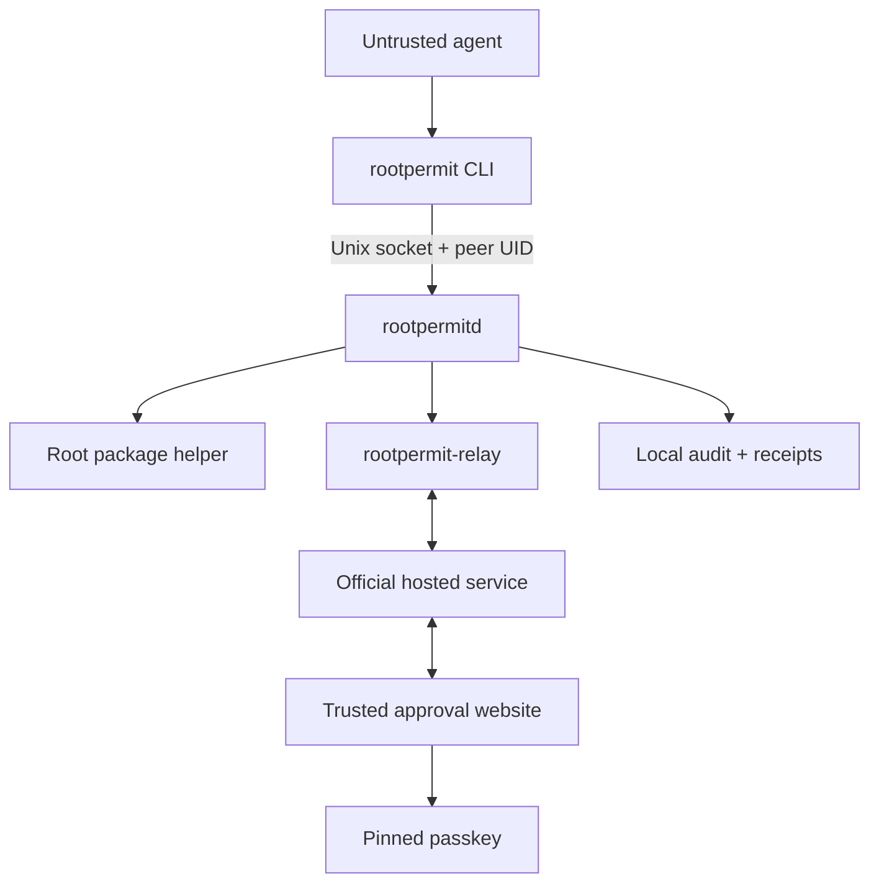
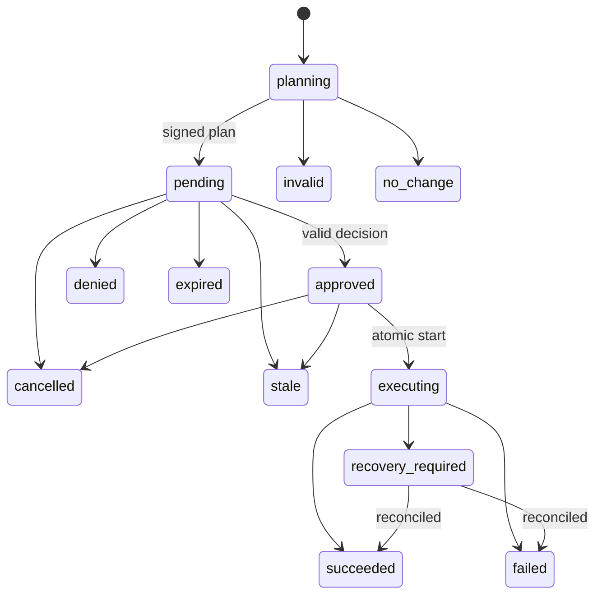

# Product Requirements Document: RootPermit

**Status:** CEO review closed  
**Version:** 1.0 reconciled baseline  
**Date:** 2026-08-11  
**MVP posture:** One security-complete vertical slice  
**Canonical design:** `rootpermit-office-hours-design.md`

## 1. Executive Summary

RootPermit lets an untrusted Linux agent request a narrowly typed privileged state transition without giving the agent `sudo`, a root shell, a reusable credential, or a temporary privileged session.

The MVP proves one complete operation: installing one package from already trusted APT repositories. A root-owned local broker resolves the request into an immutable package plan, enforces machine policy, sends a broker-signed request to the official hosted service, obtains a phone-based passkey approval, executes only the approved frozen plan, and returns a signed receipt.

RootPermit is not remote `sudo`. It authorizes an exact state transition, not an arbitrary command string or privileged identity.

## 2. Problem

Autonomous and semi-autonomous agents running on cloud VMs, local Linux computers, Raspberry Pis, and home servers sometimes need privileged host changes. Existing choices are poor:

- run the agent as root;
- grant passwordless `sudo`;
- expose a sudo password or temporary root session;
- require the operator to remain at the machine;
- build a bespoke remote command-approval flow; or
- adopt a human-session-focused privileged-access product that does not bind approval to an agent-requested state transition.

The product gap is a small, typed, auditable privilege boundary designed for software agents.

## 3. Product Thesis

The wedge is not the remote approval prompt by itself. The wedge is the complete trust chain:

1. The agent can request only a typed operation.
2. The root broker, not the agent or hosted service, resolves the exact privileged plan.
3. Root-owned policy decides whether the plan is eligible.
4. The human approves the broker-signed plan with a passkey.
5. The broker executes only that plan and never silently re-resolves it.
6. A signed receipt records the request, decision, execution, and result.

## 4. Target User

The primary user is an agent builder or developer who already lets an agent perform meaningful work on a Linux host but refuses to grant unrestricted `sudo`.

Reference environments:

- Canonical path: Ubuntu Server 26.04 LTS, AMD64 cloud VM.
- Portability gate: Raspberry Pi OS Lite 64-bit based on Debian 13, ARM64.
- Integration: generic unprivileged agent or shell harness using the `rootpermit` CLI or local structured API.

## 5. Product Principles

### 5.1 Never grant a privileged identity

The agent never receives a root credential, sudo token, privileged shell, reusable capability, or temporary blanket elevation.

### 5.2 Approve operations, not shell text

The local API accepts typed structured requests. Arbitrary commands, scripts, redirections, environment fragments, paths, URLs, and shell interpolation are outside the authorization boundary.

### 5.3 The broker is authoritative

`rootpermitd` is the sole authority for planning, request lifecycle, approval validity, execution, and receipts. The hosted service is a durable mailbox and derived read model. It cannot make the broker execute directly.

### 5.4 Bind approval to exact content

The decision binds to the request ID, device, canonical digest, frozen package plan, expiry, protocol version, approver generation, and decision bit. Any mismatch fails closed.

### 5.5 Local policy and human approval are independent gates

A request must be allowed by root-owned policy before it can be shown as approvable. Human approval cannot override a local denial.

### 5.6 Outbound device communication only

The device initiates control-plane communication. The hosted service has no inbound root channel and no root credential.

### 5.7 Fail closed and expose named failures

Network loss, stale state, invalid signatures, unknown transitions, policy drift, artifact drift, and recovery ambiguity must prevent execution and return a stable named state or error.

### 5.8 Keep the trusted root surface small

The root daemon and package helper accept structured data only. Hosted transport, notifications, and agent integration remain unprivileged.

### 5.9 One product identity

The product, Linux package, and unprivileged CLI are `rootpermit`; the daemon and systemd service are `rootpermitd`; the unprivileged transport process is `rootpermit-relay`.

Paths:

- `/etc/rootpermit/` for root-owned configuration;
- `/run/rootpermit/` for volatile runtime state; and
- `/var/lib/rootpermit/` for durable broker state.

The MVP ships no legacy command aliases.

## 6. Goals

The MVP must:

1. Prove a complete `package.install` trust chain on Ubuntu AMD64.
2. Prove the same protocol and source architecture on Raspberry Pi OS ARM64.
3. Let an existing agent integrate through a stable CLI or structured local API.
4. Complete routine approval remotely from a phone browser using a passkey.
5. Prevent the agent, network, notification provider, or another tenant from substituting the broker-authorized package plan.
6. Produce locally authoritative, broker-signed receipts.
7. Make enrollment and credential recovery possible over a trusted root SSH session without physical access.
8. Remain understandable enough for one external developer to install and use without live guidance.

## 7. Non-Goals

The first vertical slice does not include:

- arbitrary commands, scripts, or privileged shells;
- service restart, service enablement, managed services, or managed file writes;
- adding repositories, repository keys, local `.deb` files, or remote package URLs;
- firewall, SSH, user, kernel, or bootloader changes;
- native Android/iOS apps, browser extensions, or desktop signers;
- offline approvals or remembered/automatic approval rules;
- organizations, quorum approval, delegation, or multiple human roles;
- supported self-hosting, third-party control-plane compatibility, or a migration promise;
- guaranteed remote cancellation after a device loses connectivity;
- high-assurance dual/local confirmation in the MVP;
- full rollback of maintainer-script or trigger side effects; or
- proving that an approved repository package is safe.

## 8. MVP User Experience

### 8.1 One-time setup

1. The administrator installs the signed `rootpermit` Linux package.
2. The administrator signs in to the official hosted service and creates an account.
3. From an authenticated root-controlled console or trusted SSH session, the administrator starts enrollment.
4. The broker creates its device key locally and displays a one-time pairing URL or QR plus comparison code.
5. The user confirms the same transcript in the website and originating root session.
6. One to five proposed passkeys prove possession over the service-signed enrollment statement.
7. The broker pins the exact credential set and activates only after all transcript checks pass.

Physical access is not required. Browser-only or agent-controlled enrollment is forbidden.

### 8.2 Request and approval

```bash
rootpermit package install ffmpeg --operation-key <caller-generated-key>
```

1. The kernel-reported effective UID identifies the requester.
2. The broker validates the single package name and root policy.
3. The broker resolves trusted APT metadata and freezes package artifacts, versions, origins, dependencies, removals, download size, disk impact, and relevant host pre-state.
4. A plan containing a removal, downgrade, held package, unsupported source, or policy violation is not approvable.
5. The broker signs the canonical request and publishes it through `rootpermit-relay`.
6. The trusted hosted website verifies and renders the broker-signed plan.
7. The user denies or approves with one currently pinned passkey.
8. The broker verifies the decision and atomically transitions to execution.
9. The helper supplies only the frozen artifacts and approved action set to APT/dpkg.
10. The broker signs the terminal receipt and returns a structured result.

Routine approval never requires access to the machine.

### 8.3 Recovery and history

- Any process under the same effective UID may list/read that UID's retained requests and terminal receipts.
- UID 0 may inspect all local requests.
- A cross-UID direct lookup returns `not_found_or_not_authorized` and does not reveal object existence.
- The same UID or UID 0 may cancel during `planning`, `pending`, or `approved`.
- Cancellation after `executing` returns `cancellation_too_late` and never interrupts the helper.

## 9. Architecture



| Component | Trust/privilege | Responsibility |
|---|---|---|
| Agent | Untrusted, unprivileged | Submit typed request; receive structured state/result |
| `rootpermit` | Unprivileged | CLI and local API client |
| `rootpermitd` | Root, trusted | Policy, planning, canonicalization, signatures, lifecycle, execution authorization, receipts |
| Package helper | Root, narrow | Safe APT/dpkg interaction without shell syntax |
| `rootpermit-relay` | Unprivileged | Outbound transport, polling, retry, resynchronization |
| Official hosted service | Trusted service, not root principal | Accounts, tenant isolation, mailbox, derived projection, notifications, credential quarantine |
| Approval website | Trusted renderer | Verify request, display exact plan, obtain WebAuthn assertion |
| Passkey | Trusted key holder | User verification and decision signature |

## 10. Trust Model

### 10.1 May be malicious or compromised

- agent and all agent-provided text;
- unprivileged requester process;
- agent-controlled files and environment;
- transport network;
- notification provider;
- another hosted tenant; and
- guessed request IDs, operation keys, cursors, or device identifiers.

### 10.2 Trusted in the MVP

- kernel and root-owned OS security boundary;
- `rootpermitd`, package helper, root policy, and durable local state;
- configured APT repository-signature system;
- official hosted service, approval website, domain, and deployment pipeline;
- enrolled broker keys and locally pinned passkey public keys;
- passkey authenticator; and
- the administrator's authenticated root console or SSH session for enrollment and recovery.

### 10.3 Explicit residual risks

- A compromised trusted approval deployment can show operation A while requesting a passkey assertion for operation B. The MVP accepts this as a trusted-component failure and does not claim cryptographic resistance to it.
- Approved Debian packages may execute root maintainer scripts and triggers. RootPermit authenticates and freezes selected artifacts and solver actions; it does not sandbox or predict arbitrary behavior inside approved package code.
- APT enforcement feasibility must be proven before the product makes an artifact/action-set-exact claim.

## 11. Package Operation Contract

The agent supplies exactly one native-architecture Debian binary package name.

The agent cannot supply:

- version or architecture;
- repository, URL, or path;
- APT/dpkg option;
- environment variable;
- command fragment; or
- approval description that changes an authoritative field.

The broker rejects:

- invalid package-name grammar;
- root-policy deny;
- virtual, source, local, or foreign-architecture packages;
- explicit or implicit removals;
- downgrades;
- held packages;
- unsupported repositories or repository state;
- plans above configured package, download, disk, or transaction ceilings; and
- host pre-state drift affecting the approved action graph.

If the requested package is already installed at the resolved version, the broker returns a signed terminal `no_change` receipt without approval.

## 12. Request Lifecycle



Terminal receipt states are:

`no_change`, `denied`, `expired`, `cancelled`, `invalid`, `stale`, `succeeded`, `failed`, and `recovery_required`.

`recovery_required` is terminal for the original automated flow but retained without automatic deletion until root completes reconciliation.

### 12.1 Authority and projection

- The broker publishes signed append-only lifecycle events with per-request sequence, previous-event hash, request digest, and broker epoch.
- Duplicate events are idempotent.
- A sequence gap freezes the hosted projection and triggers resynchronization.
- Hosted state never overrides broker state.

### 12.2 Lifetime

- Default request lifetime: 10 minutes.
- Broker hard maximum: 30 minutes.
- Root policy may shorten but never extend the maximum.
- The monotonic deadline begins when the broker signs the request into `pending`.
- Retry, redelivery, resynchronization, or approval never extends it.

### 12.3 Concurrency

Only one non-terminal package lifecycle may exist per device. A later logical submission receives `busy`, `retryable: true`, and a bounded `retry_after`. It creates no plan, queue entry, or notification.

### 12.4 Idempotency

Every logical submission carries a caller-generated operation key.

- Same key + same canonical input returns the original intake, current state, or receipt.
- Same key + changed input returns non-retryable `idempotency_conflict`.
- A genuinely new attempt requires a new key.
- Idempotency lookup occurs before new-request concurrency and planning checks within the authenticated UID scope.

## 13. Local API Requirements

The local API uses a root-owned Unix socket and derives peer credentials from the kernel.

Required operations:

- submit `package.install`;
- get request by ID within caller scope;
- list retained requests with bounded pagination;
- cancel an eligible request;
- get terminal receipt;
- root-only inspect/export/purge/recovery operations; and
- root-only enrollment, credential-set change, and unenrollment.

The API never trusts a caller-supplied UID. Filtering occurs before lookup, counts, and pagination. Cursors are opaque and bound to caller scope.

Named intake errors include:

- `invalid_input`
- `not_allowed`
- `busy`
- `idempotency_conflict`
- `not_found_or_not_authorized`
- `credential_limit_reached`
- `credential_recovery_required`
- `cancellation_too_late`
- `storage_limit`
- `temporarily_unavailable`
- `protocol_mismatch`
- `broker_recovery_required`

Every response contains a stable code, retryable flag, bounded safe message, intake/request identifier when authorized, and optional retry-after duration.

## 14. Approval and WebAuthn Requirements

- The approval site runs on the documented official origin.
- The site verifies the broker signature and reconstructs the canonical digest before rendering.
- Authoritative fields come only from the broker-signed envelope.
- Agent explanations are clearly labeled untrusted and cannot obscure plan consequences.
- WebAuthn requires the expected RP ID and origin, user verification, canonical domain-separated challenge, currently pinned credential, generation match, expiry, and replay protection.
- Both device-bound and backup-eligible/synced passkeys are allowed; their credential class is disclosed during enrollment.
- Authenticator counter anomalies follow a documented authenticator-specific policy and are not treated as a universal clone detector.
- Approval and denial bind to distinct decision bits.

## 15. Credential and Device Lifecycle

### 15.1 Credential set

- Each active device pins one to five explicit credentials.
- Any one currently pinned credential may approve; there is no quorum.
- Each credential is independently identifiable and revocable.
- The hosted account cannot add approval authority.
- A sixth active credential fails with `credential_limit_reached`.

### 15.2 Adding or replacing credentials

- Authenticated root control through console or trusted SSH is sufficient authority.
- No already pinned credential is required.
- One proposed new credential must prove possession through a user-verified assertion over the exact service-signed enrollment statement.
- A failed or interrupted change preserves the prior safe device state.

### 15.3 Generation boundary

Every credential-set change atomically advances the broker-owned generation. All older-generation `planning`, `pending`, and `approved` requests become terminal `stale`. An already `executing` transaction continues once under its original generation.

### 15.4 Final credential revocation

Revoking the final credential succeeds and moves the device to `approval_locked`. The device retains identity, hosted binding, receipts, and audit history. New package submissions fail with `credential_recovery_required` until root-controlled recovery pins a non-empty replacement set.

### 15.5 Hosted revocation

An authenticated account may initiate authority-reducing revocation. The hosted service quarantines the credential and serializes a decision-acceptance cutoff. The broker applies the signed revocation and remains authoritative. A page opened before the cutoff carries no authority.

### 15.6 Unenrollment

Only an authenticated root-controlled console or trusted SSH session may unenroll the device. Hosted deletion, account takeover, device quarantine, or browser-only action cannot erase or replace the broker binding.

Unenrollment:

- invalidates all non-executing requests as `stale`;
- revokes the active credential set;
- emits a final signed binding acknowledgement;
- preserves historical verification keys and retained receipts;
- moves the broker to `unpaired`; and
- fails closed while execution or unresolved recovery evidence exists.

## 16. Hosted Service Requirements

The official free hosted service is the only supported coordination and approval service for the MVP. Its source is public, but the project does not ship self-hosting artifacts, compatibility promises, migration support, or operational support for forks.

The service must:

- derive immutable tenant context on every account-owned object and async path;
- enforce both tenant and object-relationship authorization;
- use high-entropy public identifiers and tenant-scoped storage/cache keys;
- propagate tenant context through workers, notifications, websockets, object storage, logs, support tooling, exports, backups, and restores;
- use TLS, encryption at rest, protected deployments, secret/dependency scanning, audited operator access, and production separation;
- hold no broker private key, passkey private key, root credential, or direct execution channel;
- enforce per-account, per-device, per-IP, and global abuse quotas;
- expose honest outage, deletion, and resynchronization states;
- publish a privacy policy describing visible metadata and retention;
- test cross-tenant denial across every data path; and
- publish a continuity statement explaining fail-closed behavior if the free service is discontinued.

## 17. Data and Retention

### Local authoritative tier

- Terminal requests, signed receipts, required audit evidence, and idempotency mappings: 90 days by default.
- Root policy may configure retention subject to quotas and disclosed capacity behavior.
- Non-terminal requests and unresolved `recovery_required` evidence are never age-deleted.
- Root may export and explicitly purge eligible terminal data with a signed purge event.

### Hosted coordination tier

- Request envelopes, decisions, lifecycle projections, bounded execution metadata, and hosted receipt copies: 30 days after terminal completion by default.
- The authenticated user may delete hosted terminal history earlier.
- Hosted deletion never changes local authority, cancellation, revocation, or receipt validity.
- Backup expiry follows a documented maximum window and cannot resurrect execution authority.

Quota pressure may reject new work or remove optional eligible cache data, but cannot silently delete active authorization state, unresolved recovery evidence, or the only retained local receipt inside policy.

## 18. Security Acceptance Criteria

The MVP is complete only when all of the following pass:

1. An unprivileged agent installs `ffmpeg` on the pinned Ubuntu image after phone approval without receiving reusable privilege.
2. The same protocol and source architecture pass on the pinned Raspberry Pi OS ARM64 fixture.
3. The website shows exact versions, dependencies, origins, sizes, device, expiry, and `Removals: none` before approval.
4. Agent, network, notification, unsigned-message, replay, and cross-tenant substitution cannot produce accepted execution.
5. Request ID, digest, device, credential, generation, expiry, protocol version, or decision-bit substitution fails closed.
6. Artifact replacement, metadata corruption, path/symlink manipulation, relevant host drift, policy rejection, and action-graph inequality fail before execution.
7. Cancellation and execution races have exactly one durable winner.
8. Credential rotation and execution races have exactly one durable winner.
9. Old-generation, revoked, expired, cancelled, denied, duplicated, or replayed approvals fail closed.
10. Cross-UID list/read/cancel attempts reveal no request existence.
11. Lost submission responses recover through idempotency without creating duplicate requests or notifications.
12. Broker crash and host reboot reconcile to an honest terminal or `recovery_required` result and never claim atomic rollback.
13. Hosted lifecycle sequence gaps freeze projection and resynchronize from broker-signed events.
14. Browser-only, agent-controlled, replayed, stale, or mismatched enrollment cannot activate a device or credential.
15. One through five credentials work; a sixth, duplicate, empty set, or account-only credential addition fails closed.
16. Total credential loss remains recoverable from authenticated root console or SSH without an old credential.
17. Revoking the final credential enters `approval_locked` without destroying device identity or history.
18. Only root-controlled console or SSH can unenroll the broker.
19. Retention, purge, export, delete, backup, and restore paths cannot erase active authority evidence or resurrect execution authority.
20. The hosted implementation passes tenant-isolation tests for APIs, workers, websockets, storage, notifications, logs, support/admin tools, backups, and restores.

## 19. Reliability and Observability

Required operational signals:

- request counts and latency by state transition;
- planning, approval, execution, and receipt-sync latency;
- structured named-error counts;
- lifecycle sequence gaps and resynchronization outcomes;
- approval expiry, denial, cancellation, and stale rates;
- APT lock, repository, artifact, and pre-state mismatch failures;
- WebAuthn verification failure classes;
- cross-tenant authorization denials;
- notification failure and cooldown metrics;
- quota consumption and rejection;
- storage and recovery-required age;
- broker/helper crash and reconciliation outcomes; and
- hosted deployment and rollback audit trail.

Logs must carry safe request/device correlation identifiers without leaking secrets, cross-tenant content, arbitrary agent output, or approval keys.

## 20. Distribution and Governance

- All edge and hosted components use Apache License 2.0.
- Public releases include the license, notices, and SPDX identifiers.
- `TRADEMARK.md` reserves the RootPermit identity and official-service presentation.
- `CONFORMANCE.md` defines versioned protocol claims and the conformance suite.
- Passing conformance tests does not imply official status, security certification, support, or endorsement.
- Initial signed `.deb` releases target AMD64 and ARM64 through GitHub Releases.
- An APT repository is deferred until release-key rotation and repository operations are documented.
- Edge and hosted deployment pipelines are separate, protected, and auditable.

## 21. MVP Milestones

### 21.1 Protocol/security prototype

Human small team: approximately 6–10 weeks. AI-assisted builder: approximately 2–4 weeks.

Deliver:

- APT enforcement spike;
- normative authorization/enrollment protocol and test vectors;
- broker state machine;
- disposable single-tenant mailbox;
- phone-only web approval;
- malicious-message tests.

This is research evidence, not a production service.

### 21.2 Ubuntu hosted alpha

Human small team: approximately 4–7 months total. AI-assisted builder: approximately 10–18 weeks total.

Deliver production tenant model, dedicated approval origin, web hardening, account/passkey lifecycle, quotas, retention/deletion, protected CI/CD, crash recovery, receipts, and Ubuntu adversarial tests.

### 21.3 Public developer release

Human small team: approximately 9–15 months total. AI-assisted builder: approximately 5–9 months total plus external review.

Deliver Raspberry Pi portability, polished onboarding, optional push, complete operations/runbooks, continuity disclosure, provenance/SBOMs, cost controls, unguided testing, and independent security assessment with remediation.

## 22. Hard Go/No-Go Gates

1. **APT enforcement report:** executable fixtures must prove solver/action equality, relevant pre-state handling, hook/trigger behavior, offline cached execution, lock behavior, and crash reconciliation. If stable interfaces cannot enforce the claim, weaken the claim before building authorization around it.
2. **Normative authorization protocol:** canonical bytes, domain separation, algorithms, WebAuthn challenge, enrollment statements, official-key rotation, expiry, lifecycle, receipt enum, downgrade behavior, and test vectors must be frozen before authorization code.
3. **Hosted isolation specification:** tenant relationships and invariants across storage, cache, queue, websocket, notifications, logs, backups, restores, support tooling, and infrastructure policy must be specified before multi-tenant alpha data.

## 23. Success Metrics

### Activation

- One external developer completes account setup, SSH-capable enrollment, first approval, receipt inspection, credential revocation, recovery, and uninstall using only documentation.
- The developer connects RootPermit to an existing agent or harness.

### Experience

- Median time from opening a valid request on the website to delivered approval is under 15 seconds, excluding package download and installation.
- Routine approval requires no machine access after enrollment.

### Security

- No known agent, network, notification, replay, cross-UID, or cross-tenant path changes the frozen APT artifacts/action set or causes unauthorized execution.
- Every authenticated request with a broker request ID produces exactly one verifiable terminal receipt.

### Portability

- Ubuntu AMD64 and Raspberry Pi OS ARM64 use the same protocol and source architecture.

## 24. Engineering Review Questions

These are implementation decisions, not open product decisions:

1. Which reviewed pairing construction should bind broker, account, and proposed credential set?
2. Which canonical serialization and domain-separation profile should the protocol use?
3. Which exact APT interfaces implement authenticated snapshotting, exact simulation, execution, and recovery?
4. Which package-manager pre-state fields can safely be ignored?
5. Which WebAuthn algorithm, attestation, discoverable-credential, and counter policies should be accepted?
6. Which account-recovery factors restore website access without becoming approval-key recovery?

## 25. Review Closure

The CEO review is complete. Product scope, trust boundaries, hosted-service posture, approval experience, local requester identity, retention, credential lifecycle, licensing, and naming are settled. Remaining questions belong to engineering review and must not silently broaden the MVP.

NO UNRESOLVED PRODUCT DECISIONS
